# User Interface Templates, Requirements and Guidelines

[Home](../../index.md)

## PDF page 94

## 4 EMV 3-D Secure User Interface Templates,

## Requirements and Guidelines

This chapter provides requirements, template examples, and guidelines for building the User Interface (UI) to support 3-D Secure authentication.

### 4.1 3-D Secure User Interface Templates

3-D Secure UI Templates provide a consistent user experience whether App-based (Native or HTML) or Browser-based. Issuers will work with their ACS to determine their specific UI content, and the UI format is driven by the Templates. To facilitate this consistency, the UI layout is defined in zones as follows:

- Header zone (Zone 1)—Contains all labels managed by the 3DS Requestor and is located at the top of the screen.

- Branding zone (Zone 2)—Contains all logos and is located between the Header and Challenge zone.

- Challenge/Processing zone (Zone 3)—Contains processing and challenge information and is located between the Branding zone and the Information zone.

- Information zone (Zone 4)—Contains additional information for the Cardholder and is located at the bottom of the screen.

---

## PDF page 95

Figure 4.1 illustrates the zones and placement of UI data elements within the zones.

Figure 4.1:  UI Template Zones—Portrait

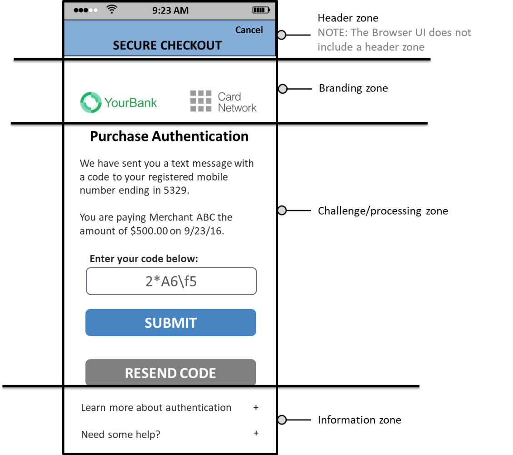

Note:  The landscape UI layout is defined to provide a consistent user experience across all consumer devices or ecosystems. For example:

- Large devices where landscape mode is the only display mode (i.e., large television screens). • Small devices where both portrait and landscape modes are available (i.e., mobile, tablets and PCs). Figure 4.2 illustrates the zones and placement of UI data elements within the zones in landscape mode.

---

## PDF page 96

Figure 4.2:  UI Template Zones—Landscape

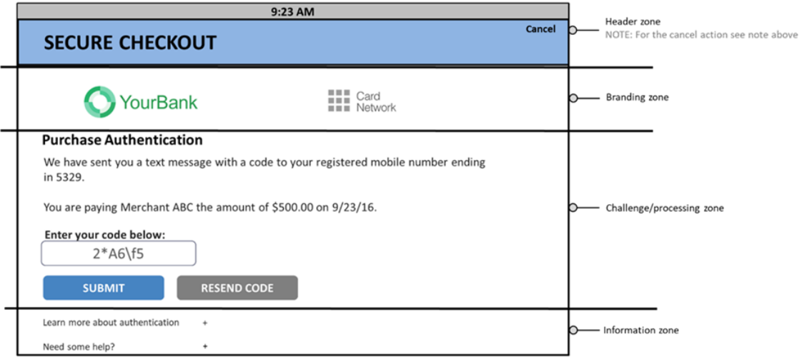

Note:  The Cancel action can be implemented as a function on a controller for the platform. Note:  Activation During Shopping (ADS) is not a supported UI template within the 3-D Secure specification. Note:  The user interface provided by the ACS for Decoupled Authentication is outside the scope of the EMV 3-D Secure protocol. Note:  Cardholder Terms and Conditions is not supported within 3-D Secure UI templates unless regulatory requirements mandate such inclusion during Cardholder payment authentication. The 3DS SDK shall:

Seq 4.1 [Req 314] Support all Device Rendering Options.

Seq 4.2 [Req 395] Support the UI template orientation(s) (i.e., portrait and landscape) according to the App Screen Orientation.

Seq 4.3 [Req 358] For the Native UI Type, display UI data elements provided by the ACS within the applicable zones as defined in Table A.20 and depicted in Figure 4.1 and Figure 4.2. The expected format is depicted in Sections 4.2.3 and 4.2.6.

Seq 4.4 [Req 418] Support full-screen vertical and horizontal scrolling for HTML UI, and at minimum, support full-screen vertical scrolling for the Native UI, for all ACS- provided content. The Header zone may remain anchored at the top of the display.

Seq 4.5 [Req 391] Ensure that the Header zone for the UI does not occupy more than 10 percent of the screen height.

The ACS shall:

Seq 4.6 [Req 342] Support all ACS Rendering Types for the ACS supported authentication methods, at a minimum at least one ACS UI Template for each ACS Interface in addition to the Information UI template.

Seq 4.7 [Req 359] For the App-based HTML UI Type and Browser-based UI, create HTML with form elements within the applicable zones as outlined in Figure 4.1 and Figure 4.2. The format is outlined in Sections 4.2.6 and 4.3.3.

---

## PDF page 97

Figure 4.3 through Figure 4.5: illustrate the consistency of the look and feel across device channels and implementations.

Figure 4.3:  UI Template Examples—All Device Channels

Figure 4.4 illustrates the consistency of the UI in landscape mode.

Figure 4.4:  UI Template Examples—App-based—Landscape

Note:  The device header is optional and may not be present depending on the 3DS Requestor implementation and OS constraints. Figure 4.5 depicts sample Native UI formats with or without a device header.

---

## PDF page 98

Figure 4.5:  Sample UI OTP/Text Template with/without Device Header

### 4.2 App-based User Interface Overview

In an App-based implementation, the 3DS Requestor App and the 3DS SDK control the rendering of the UI. Each 3DS SDK is responsible for creating the UI elements that are specific to that particular environment, for example, the operating systems (OS) on a Consumer Device. The Consumer Device determines the UI format. Either:

- Native

- HTML

- Both Native and HTML

Note:  The UI format should remain consistent during the CReq/CRes message exchange. For example, if starting with a Native format, then every exchange should remain a Native format. The supported digital image file types are png and jpeg. Any other image types implemented by the ACS may not be supported by the 3DS SDK. Note: Some platforms may not natively support all image types.

---

## PDF page 99

Figure 4.6 depicts three App-based interface scenarios and illustrates a unique 3DS SDK for each.

Figure 4.6:  3DS SDK Options

### 4.2.1 Processing Screen Requirements

During message exchanges, a screen should be displayed to the Cardholder to indicate that 3-D Secure processing is occurring. The processing screen is applicable to both Native and HTML implementations.

---

## PDF page 100

Figure 4.7 and Figure 4.8 provide sample formats for the App-based Processing screen that contains both the Processing Graphic and the Logo.

Figure 4.7:  Sample App-based Processing Screen—Portrait

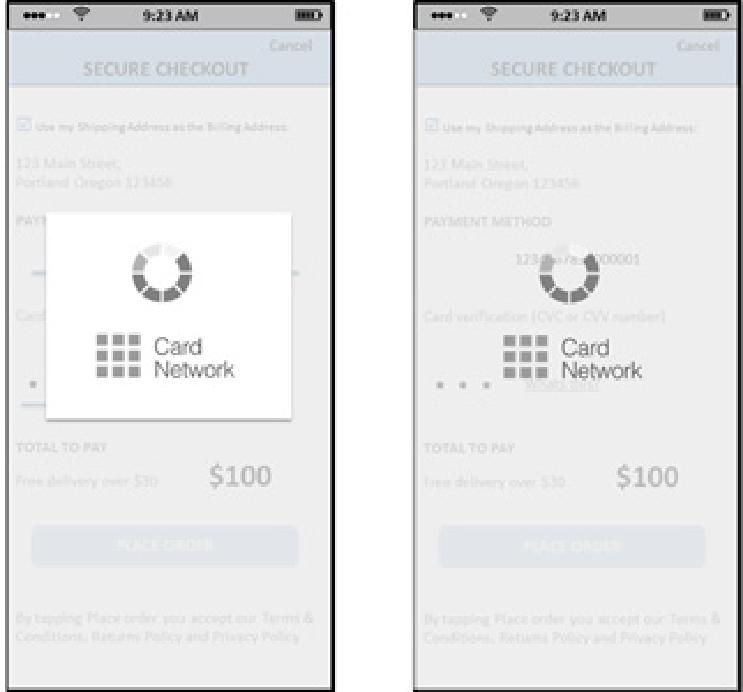

Figure 4.8:  Sample App-based Processing Screen—Landscape

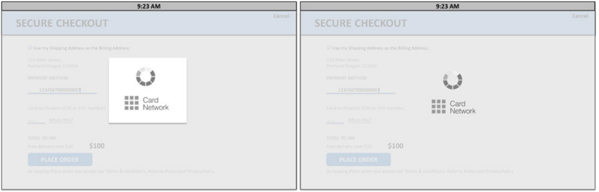

### 4.2.1.1 3DS SDK/3DS Requestor App

The 3DS SDK shall for the AReq/ARes message exchange:

Seq 4.8 [Req 141] Create a Processing screen for display during AReq/ARes message cycle.

Seq 4.9 [Req 142] Not include any other design element or text in the Processing screen.

Seq 4.10 [Req 143] Integrate the Processing Graphic and if requested, the DS logo into the centre of the Processing screen as depicted in Figure 4.7 and Figure 4.8 with or without a white box.

---

## PDF page 101

Seq 4.11 [Req 144] Store the DS logo.

The 3DS Requestor App shall for the AReq/ARes message exchange:

Seq 4.12 [Req 145] Display the Processing screen supplied by the 3DS SDK during the entire AReq/ARes message cycle and overlay on the Merchant checkout page as depicted in Figure 4.7 and Figure 4.8.

Seq 4.13 [Req 146] Display the Processing screen for a minimum of two seconds.

The 3DS Requestor App shall in case of challenge:

Seq 4.14 [Req 388] Set the Header zone text and the Cancel action name to be displayed by the 3DS SDK.

The 3DS SDK shall for the CReq/CRes message exchange:

Seq 4.15 [Req 147] Create the Processing screen with only the default Processing Graphic (for example, a progress bar or a spinning wheel) of the Consumer Device OS without words, text or white box (See Figure 4.9–Figure 4.12).

Seq 4.16 [Req 148] Not include the DS logo or any other design element in the Processing screen.

Seq 4.17 [Req 151] Display the Processing screen for a minimum of one second during the second and subsequent CReq/CRes message cycle. (For the first CReq/CRes message cycle, see [Req 153]).

Seq 4.18 [Req 389] Ensure that the Cancel action is not actionable while displaying the Processing screen.

Figure 4.9 provides a sample format for the App-based processing flow.

Figure 4.9:  Sample OTP/Text Template—App-based Processing Flow

---

## PDF page 102

Figure 4.10 provides a sample format for the OOB template for a manual transfer to and from the OOB Authentication App for an App-based processing flow.

Figure 4.10:  Sample OOB Template (Manual transfer to and from the OOB App)—App- based Processing Flow

Figure 4.11 provides a sample format for the OOB template for a manual transfer to the OOB App and an automatic return to the 3DS Requestor App for an App-based processing flow. The 3DS Requestor and OOB Apps are on the same device.

Figure 4.11:  Sample OOB Template (OOB App and 3DS Requestor App on same device)—w/o OOB App launch button—App-based Processing Flow

---

## PDF page 103

Figure 4.12 provides a sample format for the OOB template for an automatic transfer to and from the OOB App for the App-based processing flow. The 3DS Requestor and OOB Apps are on the same device.

Figure 4.12:  Sample OOB Template (OOB App and 3DS Requestor App on same device with OOB App launch button)—App-based Processing Flow

Figure 4.13 provides a sample format for the Decoupled Authentication Flow.

---

## PDF page 104

Figure 4.13:  Sample Decoupled Authentication Template—App-based Processing Flow

Notes:

- There is no difference in Native vs. HTML experience.

- The 3DS SDK could dim the challenge window during spinning wheel display or the wheel could be translucent.

- The spinning wheel would be displayed through the timeout/retry process.

- If the Cardholder has been authenticated, then the Cardholder is returned to the Merchant. If the Cardholder has not authenticated, then the UI is updated to reinforce the expected Cardholder action.

- For Decoupled Authentication, the UI provided by the ACS for Cardholder authentication is out of scope of the EMV 3-D Secure specifications.

### 4.2.2 Native UI Display Requirements

The Native UI integrates into the 3DS Requestor App UI to facilitate a consistent user experience. The Native UI has a similar look and feel to the 3DS Requestor’s App, with the authentication content provided by the Issuer. This format also allows for Issuer and Payment System branding. Both the 3DS Requestor App and the 3DS SDK control the rendering of the UI such that the authentication pages inherit the 3DS Requestor’s UI design elements (for example, fonts). Details of the UI

---

## PDF page 105

rendering process through a 3DS SDK are separately described in the EMV 3-D Secure SDK—Technical Guide. While the Issuer provides the content for the UI, the 3DS SDK is responsible for rendering the content. As such, the 3DS SDK can fine tune the UI to best display on the Consumer Device. With the 3DS SDK’s knowledge of the device screen size and orientation, font size, etc., the 3DS SDK can optimise the content provided by the Issuer (for example, by removing an extra line feed that would cause scrolling). Issuers should understand that the formatting provided in the CRes message may not be exactly what is displayed to the Cardholder.

### 4.2.2.1 3DS SDK/ACS

The 3DS SDK shall for the CReq/CRes message exchange:

Seq 4.19 [Req 362] For the ACS UI Type and the App Screen Orientation, display all the provided UI data elements in their applicable zones and order as defined in Table A.20 and depicted in Figure 4.1 and Figure 4.2. The expected format is depicted in Sections 4.2.3 and 4.2.6.

If the 3DS SDK receives an unsupported UI data element(s) for this ACS UI Type, the 3DS SDK does not display the UI data elements, proceeds with the challenge and does not send an Error Message to the ACS.

Seq 4.20 [Req 398] For the ACS UI Type, the 3DS SDK returns to the ACS an Error Message (as defined in Section A.9) with Error Component = C and Error Code = 201 if any mandatory UI data elements are missing as defined in Table A.20.

Seq 4.21 [Req 363] Interpret and place the carriage return on the screen when provided in the CRes message by the ACS.

Seq 4.22 [Req 364] Not display any UI elements other than those provided in the CRes message by the ACS in the Branding, Challenge/Processing and Information zones.

Seq 4.23 [Req 365] Display the Expandable Information Label as a graphical control element that can be expanded (for example, an accordion).

Seq 4.24 [Req 366] Display the Expandable Information Text only when the Cardholder selects the Expandable Information Label.

Seq 4.25 [Req 367] Display the Why Information Label as a graphical control element that can be expanded (for example, an accordion).

Seq 4.26 [Req 368] Display the Why Information Text only when the Cardholder selects the Why Information Label.

Seq 4.27 [Req 369] Provide the Cancel action. This can be implemented as a button in the top corner of the header zone as depicted in Figure 4.1 and Figure 4.2 and/or as a function on a controller for the platform.

Seq 4.28 [Req 392] Display the Trust List Information Text with the default setting = Off so that a Cardholder action is required to generate a Y value in Trust List Data Entry.

Seq 4.29 [Req 446] Display the Device Binding Information Text with the default setting = Off so that a Cardholder action is required to generate a Y value in Device Binding Data Entry.

The ACS shall for the CReq/CRes message exchange:

Seq 4.30 [Req 387] Include only the ACS-chosen UI data elements supported for the selected ACS UI Type as defined in Table A.20.

---

## PDF page 106

Seq 4.31 [Req 370] If used, represent a carriage return as specified in Table A.1 for the following data elements:

- Challenge Information Text

- Expandable Information Text

- Why Information Text

Seq 4.32 [Req 445] If used, represent a bold text as specified in Table A.1 for the following data elements:

- Challenge Information Text

- Expandable Information Text

- Why Information Text

Seq 4.33 [Req 429] Include the image in either png or jpeg format when providing the Issuer Image and Payment System Image.

### 4.2.3 Native UI Templates

Figure 4.14–Figure 4.37 depict sample Native UI templates. The UI content is provided by the ACS in the CRes message which contains the information needed to properly display the UI. UI elements exceptions are depicted in the figures as “Label Managed by the 3DS Requestor” and the functionality of these items are managed by the 3DS SDK.

---

## PDF page 107

Figure 4.14 and Figure 4.15 provide sample formats for a one-time passcode (OTP)/Text during a Payment Authentication transaction. This sample UI provides a format using expandable fields for additional information.

Figure 4.14:  Sample Native UI OTP/Text Template—PA—Portrait

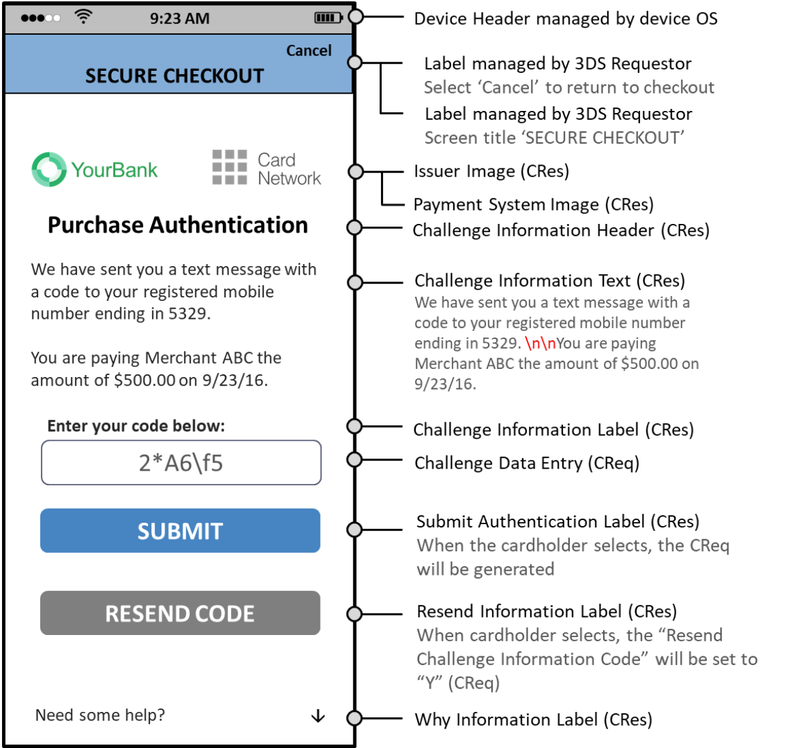

---

## PDF page 108

Figure 4.15:  Sample Native UI OTP/Text Template—PA—Landscape

Figure 4.16 and Figure 4.17 provide sample formats with the optional second one-time passcode (OTP)/Text during a Payment Authentication transaction. This sample UI provides a format using expandable fields for additional information.

---

## PDF page 109

Figure 4.16:  Sample Native UI with Optional Second OTP/Text entries Template— PA—Portrait

Figure 4.17:  Sample Native UI with Optional Second OTP/Text entries Template— PA—Landscape

---

## PDF page 110

Figure 4.18 provides a sample format for a one-time passcode (OTP)/Text during a Non- Payment Authentication transaction.

Figure 4.18:  Sample Native UI OTP/Text Template—NPA

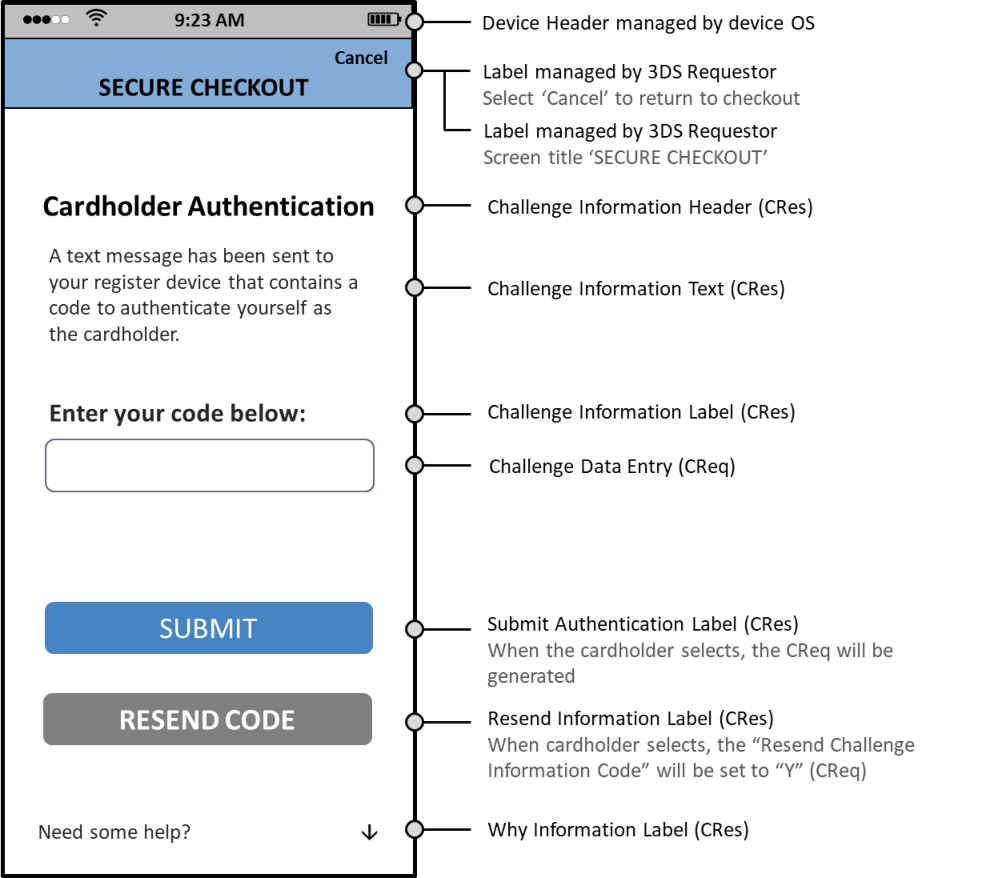

Figure 4.19 and Figure 4.20 provide sample formats that allows multiple options to be presented to the Cardholder to obtain single response. For example, asking the Cardholder if they prefer the OTP to be sent to the Consumer Device or to the email address on file. Note:  To optimise the Cardholder experience, the Challenge Selection Information can be displayed horizontally or vertically in landscape.

---

## PDF page 111

Figure 4.19:  Sample Native UI—Single-select Information—PA—Portrait

Figure 4.20:  Sample Native UI—Single-select Information—PA—Landscape

---

## PDF page 112

Figure 4.21 and Figure 4.22 provide sample formats that allows multiple options to be presented to the Cardholder to obtain multiple responses on a single screen. For example, asking the Cardholder to select the cities where they have lived. This example also depicts a screen with no Issuer or Payment System branding. Note:  To optimise the Cardholder experience, the Challenge Selection Information can be displayed horizontally or vertically in landscape.

Figure 4.21:  Sample Native UI—Multi-select Information—PA—Portrait

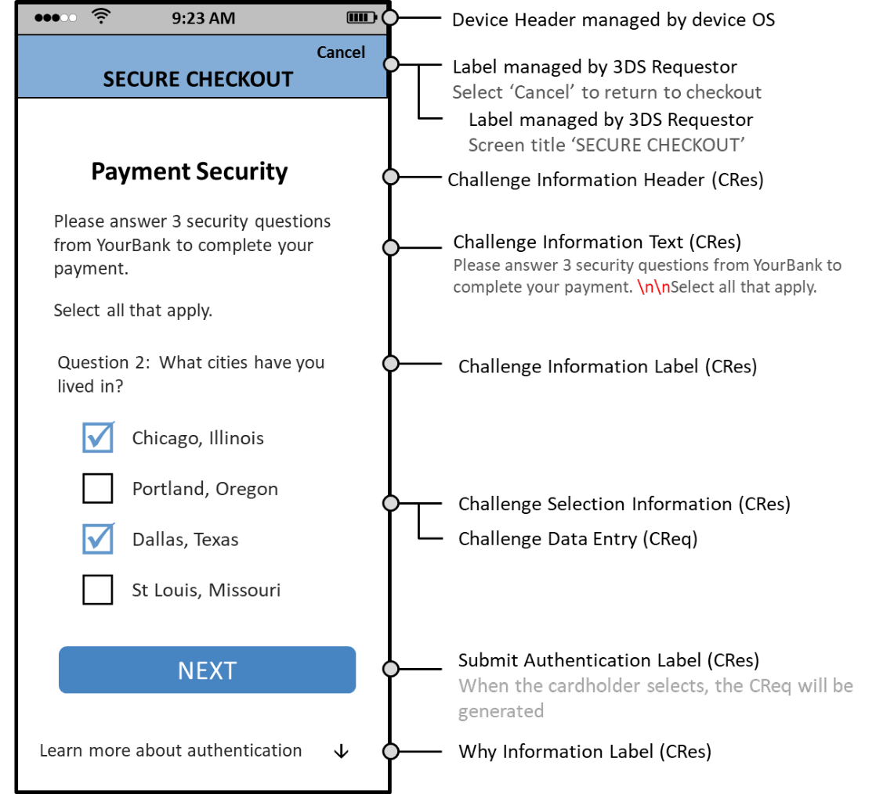

---

## PDF page 113

Figure 4.22:  Sample Native UI—Multi-select Information—PA—Landscape

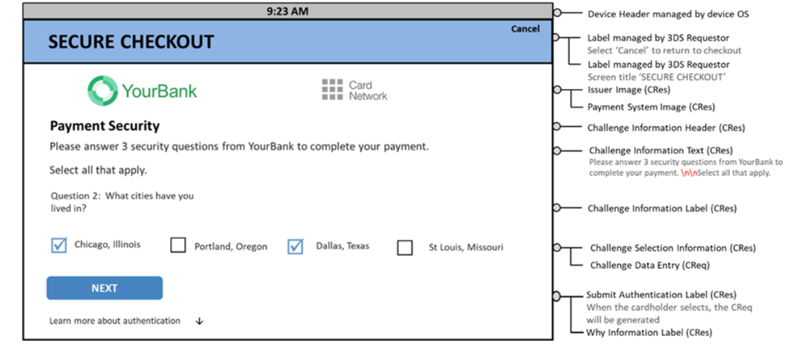

The Out-of-Band (OOB) user interface allows Issuers to use authentication methods other than dynamic and static data such as an Issuer’s mobile app. When an OOB challenge is necessary, the Issuer/ACS provides instructions to the Cardholder to explain the authentication process. Figure 4.23 and Figure 4.26 provide sample OOB formats to display instructions to the Cardholder.

---

## PDF page 114

Figure 4.23:  Sample OOB Native UI Template with Complete button—PA—Portrait

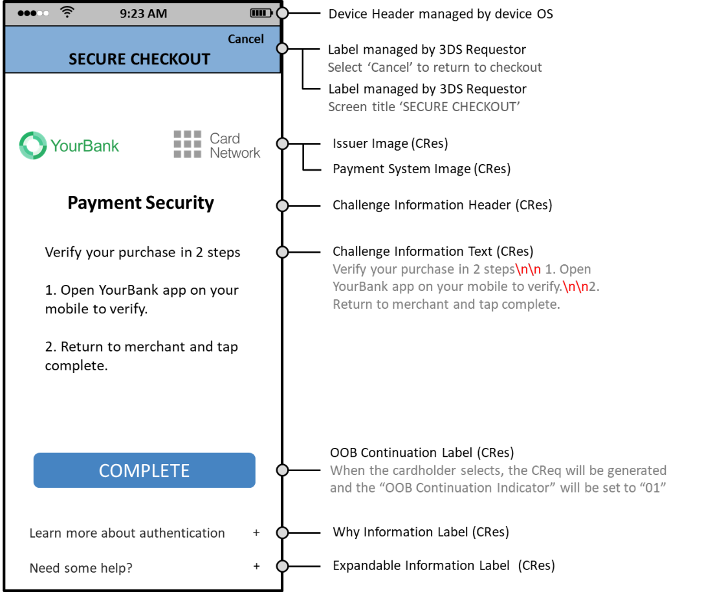

Figure 4.24:  Sample OOB Native UI Template with Complete button—PA—Landscape

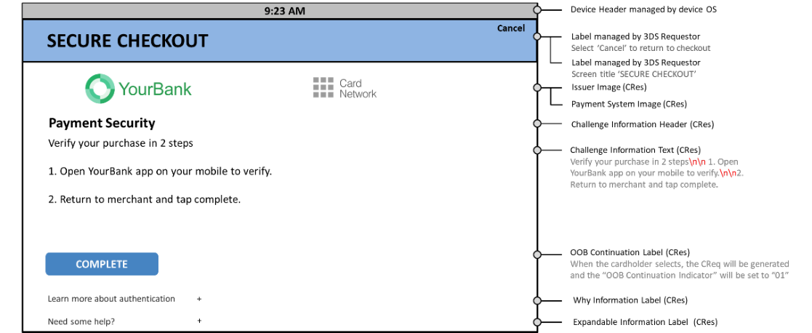

Figure 4.25 and Figure 4.26 provide sample OOB formats that display a button to open an Authentication App.

---

## PDF page 115

Figure 4.25:  Sample OOB Native UI Template with Automatic OOB App URL link— Portrait

Figure 4.26:  Sample OOB Native UI Template with Automatic OOB App URL link— Landscape

---

## PDF page 116

Figure 4.27 provides a sample of how the Challenge Information Text Indicator may be displayed to the Cardholder.

Figure 4.27:  Sample Challenge Information Text Indicator—PA

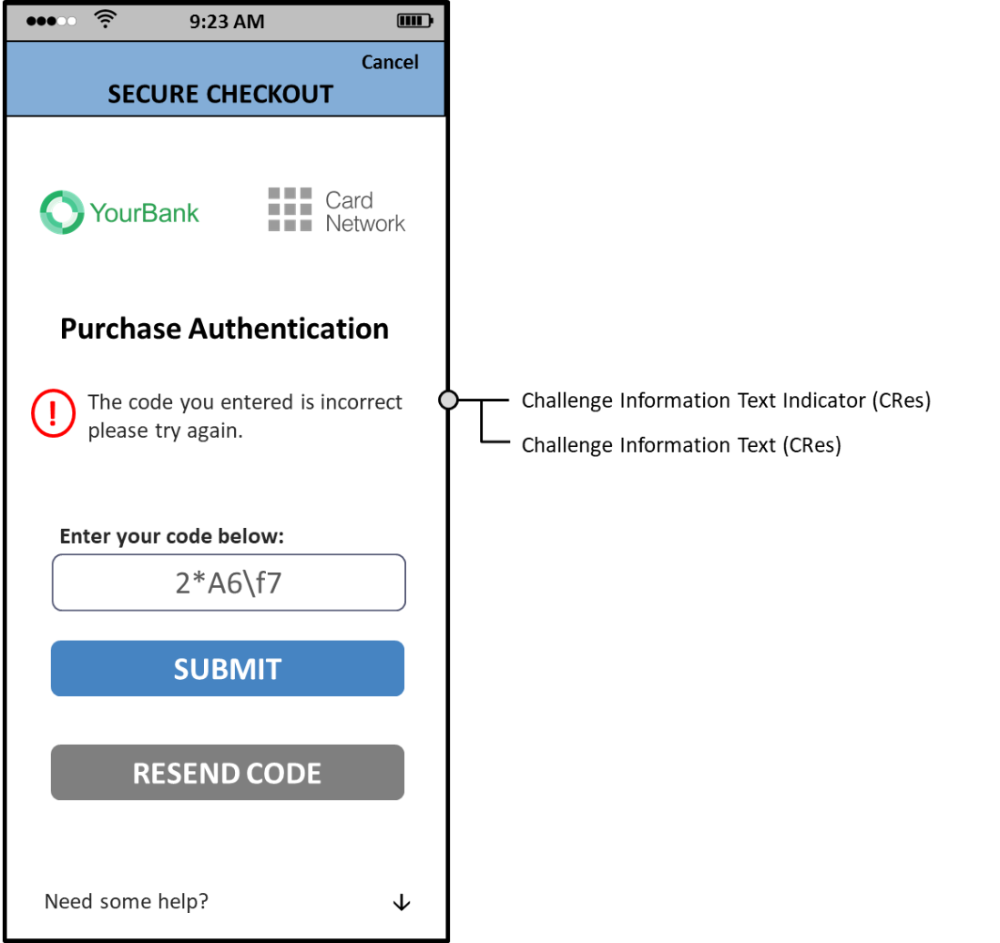

---

## PDF page 117

Figure 4.28–Figure 4.33 provide sample formats that display the two possible positions for the Trust List option and Device Binding option (above or below the buttons) as defined in Table A.20. Note:  The sample format depicts the UI after the Cardholder has entered the OTP and selected the Trust List and/or the Device Binding checkbox or switches.

Figure 4.28:  Sample Trust List/Device Binding Information Text—PA—Portrait

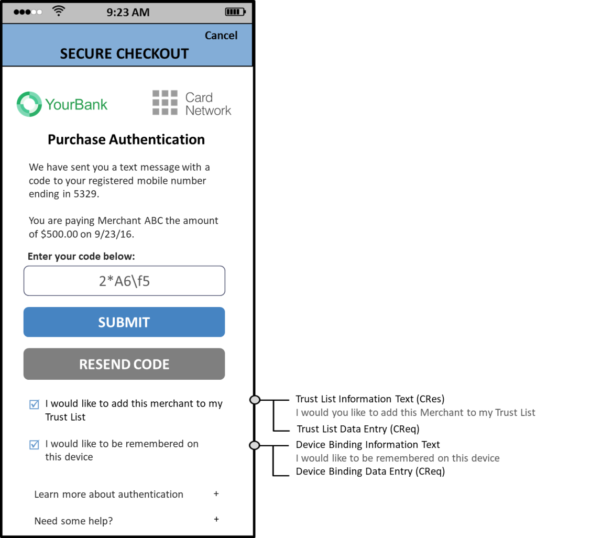

---

## PDF page 118

Figure 4.29:  Sample Trust List/Device Binding Information Text—PA—Portrait

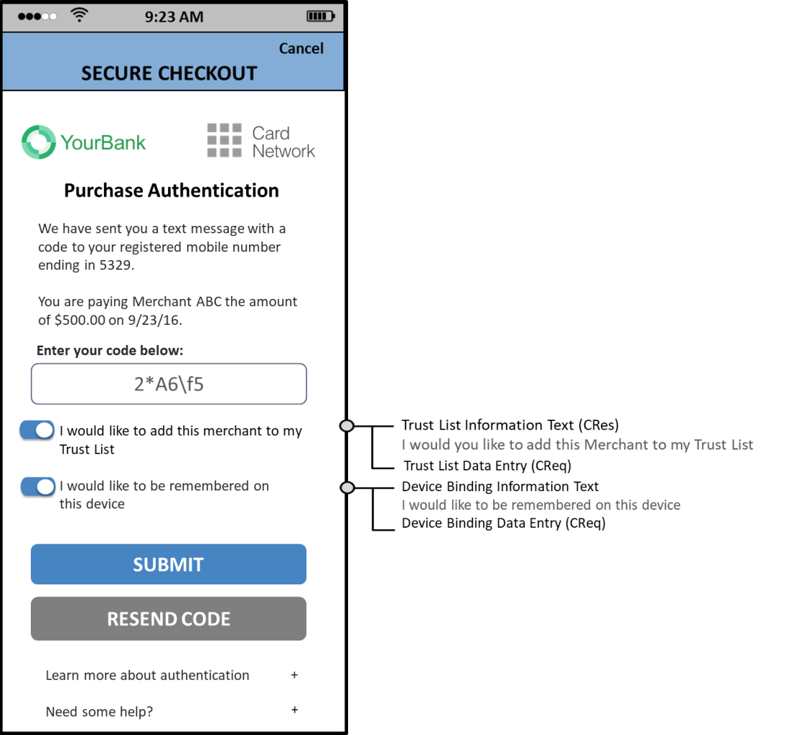

Figure 4.30:  Sample Trust List/Device Binding Information Text—PA—Landscape

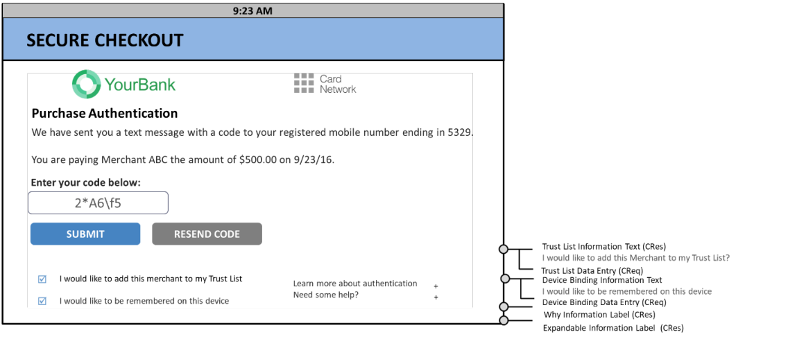

---

## PDF page 119

Figure 4.31:  Sample Trust List/Device Binding Information Text—PA—Landscape

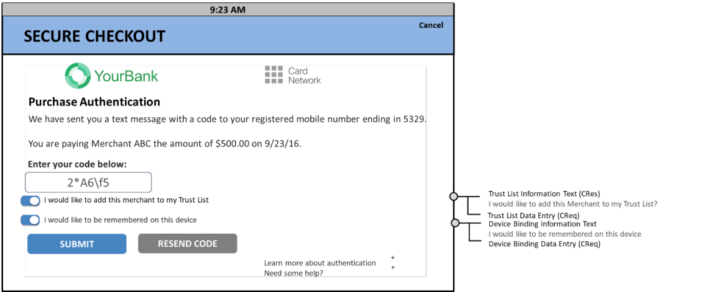

Figure 4.32 and Figure 4.33 provide sample UI formats to display instructions to the Cardholder. The Information user interface allows Issuers to display specific information during the challenge, for example to recover from an error situation or for the Cardholder to confirm consent.

---

## PDF page 120

Figure 4.32:  Sample Information Native UI Template—PA—Portrait

Figure 4.33:  Sample Information Native UI Template—PA—Landscape

Figure 4.34 and Figure 4.35 provide a sample format that uses the Challenge Data Entry Masking and Challenge Data Entry Masking Toggle options during a purchase authentication. Note:  The sample format depicts the UI after the Cardholder enters the OTP and selects the Challenge Data Entry Masking Toggle.

---

## PDF page 121

Figure 4.34:  Sample Challenge Data Entry Masking—PA

Figure 4.35:  Sample Data Entry Masking with Toggle

---

## PDF page 122

Figure 4.36 and Figure 4.37 provide sample formats with the Challenge Additional Label which provides additional flexibility in challenge management available for all UI templates.

Figure 4.36:  Native UI OTP/Text Template with Challenge Additional Label—PA— Portrait

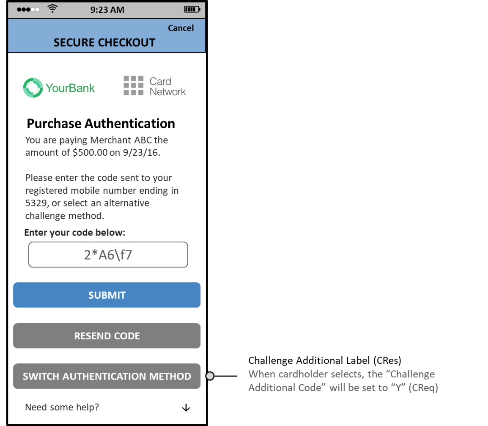

---

## PDF page 123

Figure 4.37:  Sample Native UI OTP/Text Template with Challenge Additional Label— PA—Landscape

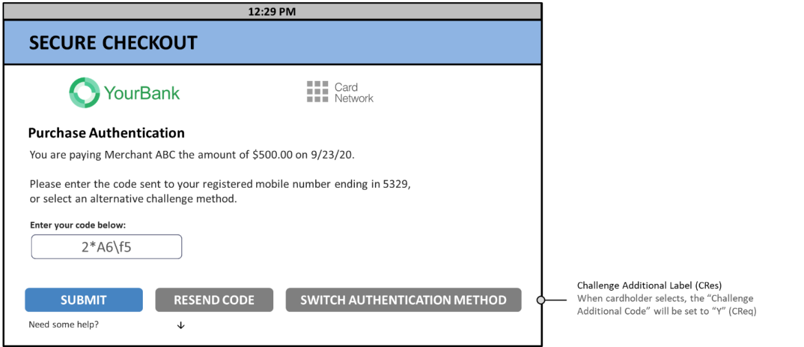

### 4.2.4 Native UI Message Exchange Requirements

The CReq/CRes message exchange is the same for both Native and HTML, however, there is a difference in the data elements and templates. This section identifies the requirements for an App-based Native UI.

### 4.2.4.1 3DS SDK

The 3DS SDK shall:

Seq 4.34 [Req 153] After submitting the CReq message to the ACS, display the same Processing screen as during the AReq/ARes message until the CRes message is received, or timeout is exceeded. Refer to Section 5.5.2.2 for CReq/CRes message timeout requirements.

### 4.2.4.2 ACS

As defined via the requirements in Section 3.1, the ACS will: Use the secure CReq/CRes channel through the 3DS SDK for communication with the Consumer Device and populate the applicable ACS UI Type that the 3DS SDK will need to display as identified in [Req 55]. The ACS will continue the Challenge message cycle until complete. Whether the cycle is completed is communicated to the 3DS SDK via the Challenge Completion Indicator data element in the CRes message. The CRes message sent to the 3DS SDK will populate the appropriate data elements to render the screen as designed by the Issuer/ACS.

### 4.2.4.3 3DS SDK

The 3DS SDK shall:

Seq 4.35 [Req 154] Act upon any action to exit the 3DS SDK (for example, the Cancel action on screen or through an external controller) and return control to the 3DS Requestor App.

After receiving the CRes message from the ACS, the 3DS SDK displays the requested content through the 3DS Requestor App. The 3DS SDK shall:

---

## PDF page 124

Seq 4.36 [Req 155] Control UI interaction processing, for example, the Cancel action.

Seq 4.37 [Req 156] Have the option to display a screen title.

Seq 4.38 [Req 157] Return control to the 3DS Requestor App when the Cancel is activated.

Seq 4.39 [Req 158] Create and generate the CReq message to return to the ACS in response to Cardholder interaction with the UI.

Seq 4.40 [Req 473] If the Cardholder does not enter any data in the UI, send the Challenge No Entry field with the value = Y in the CReq message.

Note:  The CReq/CRes message exchange continues until the Challenge Completion Indicator in the CRes is set to Y by the ACS or until the 3DS SDK times out.

### 4.2.5 HTML UI Display Requirements

The HTML UI provides Cardholders with an Issuer-consistent App-based experience across Consumer Devices that are able to render HTML. The HTML UI templates provides Issuers the ability to include Issuer-specific design elements (for example, branding, colours, and/or fonts). The 3DS SDK will display the HTML as provided by the Issuer. As such, it is the Issuer’s responsibility to format the HTML to best display on the Consumer Device. Unlike the Native UI where the 3DS SDK can adjust the content provided by the Issuer, the HTML provided by the Issuer will be what is displayed to the Cardholder. The HTML UI implementation establishes a client–server relationship between the ACS- provided HTML document loaded in a 3DS Requestor’s web view and the 3DS SDK process itself. This is accomplished by intercepting remote URL requests issued by the web view, and handling them within the 3DS SDK, rather than allowing them to pass through to the Consumer Device operating system and hence on to the Internet. This has two effects:

- Prevents maliciously formed HTML within the web view flow from requesting external resources or redirecting to an external malicious site (for example, a phishing page).

- Changes the web view form into an extension of the 3DS SDK’s UI, one that is defined by the remote ACS using HTML, rather than by the 3DS SDK or 3DS Requestor’s App.

Key HTML UI considerations:

- The contents of the web view are received as responsive HTML directly from the ACS and displayed in the web view by the 3DS SDK. Navigation attempts from within the web view are captured by the 3DS SDK and processed internally, rather than being passed to the operating system and network stack. In addition to navigation attempts, the 3DS SDK also captures external resource requests (image loads, external.JS scripts, CSS, etc.).

- The web view element is not being used as a Browser, but as a UI element whose content is the HTML and Cascading Style Sheets (CSS) provided by the ACS.

- A secure communication channel is established between the Consumer Device and the ACS for routing all the network communications. By defining all interaction with the web view in terms of the 3DS SDK, it clearly indicates that the 3DS SDK defines and owns the UI, and that the 3DS Requestor’s App is isolated from the challenge interaction.

---

## PDF page 125

Details of the HTML UI and the rendering process are separately described in the applicable 3DS SDK specification and in the documentation provided by each DS. Note:  App-based HTML will function on all Consumer Devices that support HTML display.

### 4.2.5.1 3DS SDK/ACS

The 3DS SDK shall for the CReq/CRes message exchange:

Seq 4.41 [Req 371] Display the HTML as provided by the ACS.

Seq 4.42 [Req 372] Display only the UI elements provided by the ACS in the Branding, Challenge/Processing and Information zones.

Seq 4.43 [Req 373] Provide the Cancel action. This can be implemented as a button in the top corner of the header zone as depicted in Figure 4.1 and Figure 4.2 and/or as a function on a controller for the platform.

Note: The functionality of UI elements in the header zone is managed by the 3DS SDK. The ACS shall for the CReq/CRes exchange:

Seq 4.44 [Req 374] Create HTML with form elements in the applicable zones as outlined in Figure 4.1 and Figure 4.2 to support both portrait and landscape UI templates. The expected format is outlined in Section 4.2.6.

The ACS shall, if providing values for the form elements corresponding to the following data elements, provide the:

Seq 4.45 [Req 375] Expandable Information Label for display as a graphical control element that can be expanded (for example, an accordion) in the Information zone.

Seq 4.46 [Req 376] Expandable Information Text for display in the Information zone only when the Cardholder selects the Expandable Information Label.

Seq 4.47 [Req 377] Why Information Label for display as a graphical control element that can be expanded (for example, an accordion) in the Information zone.

Seq 4.48 [Req 378] Why Information Text for display in the Information zone only when the Cardholder selects the Why Information Label.

### 4.2.6 HTML UI Templates

The HTML UI templates provide the ACS the ability to include Issuer-specific design elements (e.g., branding, colours, fonts) as shown in the figures below. Figure 4.38 and Figure 4.39 provide sample Payment Authentication HTML OTP UI templates that include Issuer branding.

---

## PDF page 126

Figure 4.38:  Sample HTML UI OTP/Text Template—PA—Portrait

Figure 4.39:  Sample HTML UI OTP/Text Template—PA—Landscape

---

## PDF page 127

Figure 4.40 provides a sample Non-Payment Authentication HTML OTP UI template that includes Issuer branding. The HTML templates for Single-select and Multi-select are visually similar to the Native UI and therefore not repeated.

Figure 4.40:  Sample UI OTP/Text Template—NPA

---

## PDF page 128

Figure 4.41–Figure 4.44 provide sample templates illustrating the OOB HTML UI.

Figure 4.41:  Sample OOB HTML UI Template with Complete button—PA—Portrait

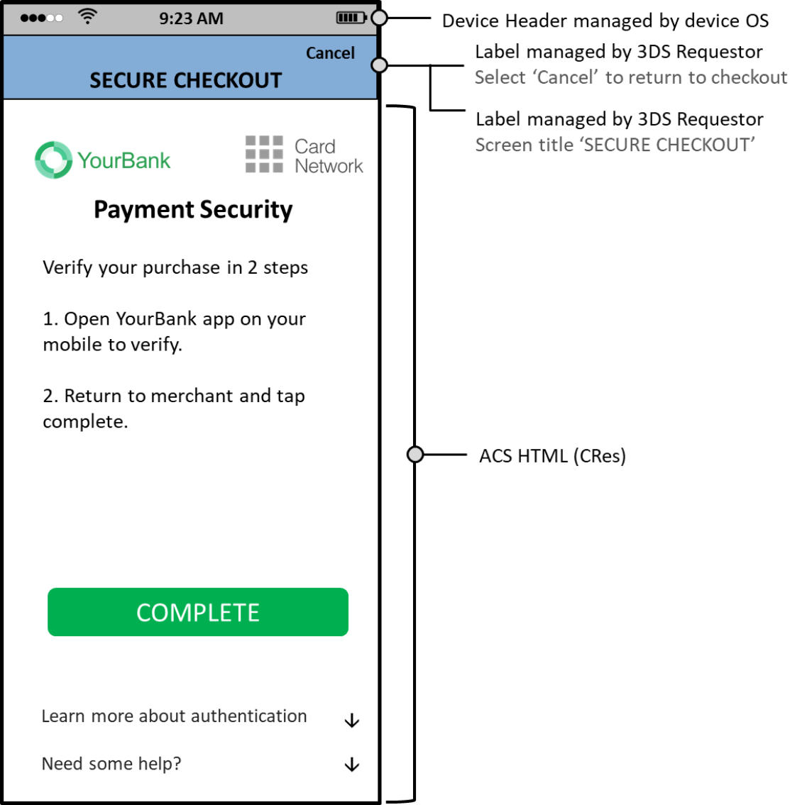

---

## PDF page 129

Figure 4.42:  Sample OOB HTML UI Template with Complete button—PA—Landscape

---

## PDF page 130

Figure 4.43:  Sample OOB HTML UI Template with OOB App URL button—PA—Portrait

---

## PDF page 131

Figure 4.44:  Sample OOB HTML UI Template with OOB App URL button—PA— Landscape

Figure 4.45 and Figure 4.46 provide sample HTML Information UI templates to display instructions to the Cardholder that includes Issuer branding. The Information user interface allows Issuers to display specific information during the challenge, for example to recover from an error situation or for the Cardholder to confirm consent.

---

## PDF page 132

Figure 4.45:  Sample Information HTML UI Template—Portrait

---

## PDF page 133

Figure 4.46:  Sample Information HTML UI Template—Landscape

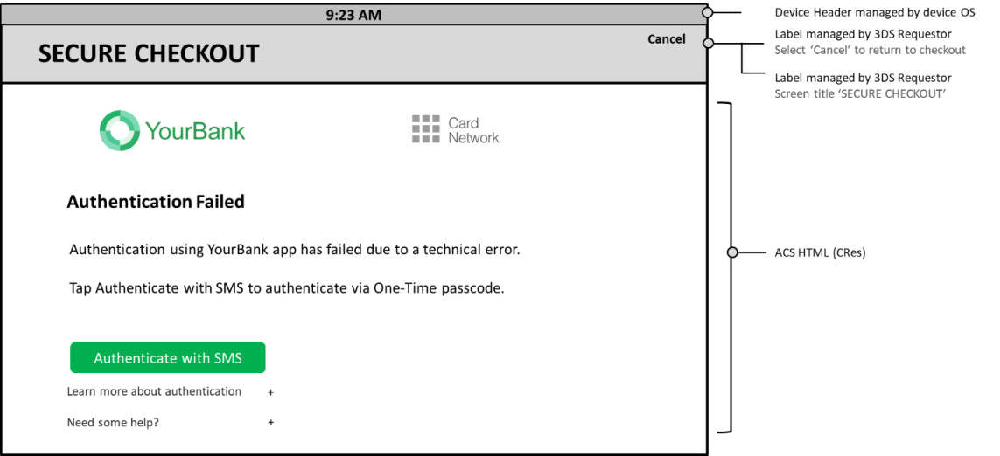

### 4.2.6.1 HTML Other UI Templates

The HTML Other UI Template allows Issuers to perform authentication functionality other than the existing Native data element options standard templates. This option is exclusive to the HTML UI, adheres to the HTML template guidelines and will also be subject to the rules of the specific DS.

---

## PDF page 134

Figure 4.47 and Figure 4.48 provide sample HTML Other templates asking the Cardholder to answer questions and confirm an image. There is not an existing data element in the Native format that supports the presentation of an image during authentication, however, the HTML Other will allow for this authentication experience.

Figure 4.47:  Sample HTML Other UI Template—PA—Portrait

---

## PDF page 135

Figure 4.48:  Sample HTML Other UI Template—PA—Landscape

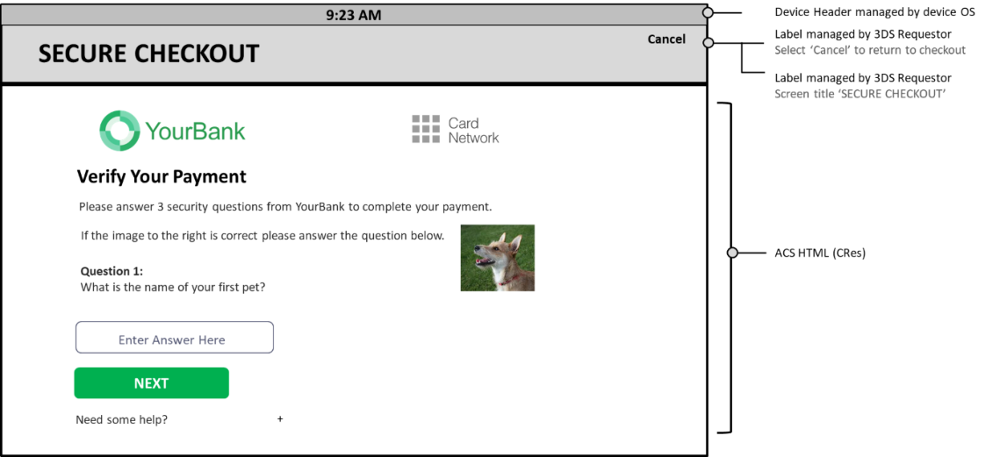

### 4.2.7 HTML Message Exchange Requirements

This section identifies the requirements for an App-based HTML UI.

### 4.2.7.1 3DS SDK

The 3DS SDK shall:

Seq 4.49 [Req 159] After submitting the CReq message to the ACS, display the 3DS App Processing screen until the CRes message is received or timeout exceeded.

### 4.2.7.2 ACS

The ACS shall:

Seq 4.50 [Req 160] Ensure the HTML provided does not contain external references, either navigation attempts or external resource requests.

Seq 4.51 [Req 161] Embed CSS and image data to be processed and rendered within the web view entirely within the HTML.

Seq 4.52 [Req 162] Provide a fully formed HTML document, including CSS and logos, following Responsive Design principles.

Seq 4.53 [Req 163] Embed all resources in the ACS-provided HTML and not fetched via external URLs.

Seq 4.54 [Req 164] Include in the ACS HTML an action which triggers a location change to a specified (HTTPS://EMV3DS/challenge) URL upon the Cardholder completing data input and pressing Submit, for ACS UI Type = 05, and only if manual app switching is used for OOB for ACS UI Type = 06.

Note:  The ACS uses the location setting technique described above to communicate back to itself through the secure CReq/CRes channel.

Seq 4.55 [Req 165] Not bypass the 3DS SDK or connect back to itself directly.

As defined via the requirements in Section 3.1, the ACS will then use the secure CReq/CRes channel through the 3DS SDK for communication with the Consumer Device.

---

## PDF page 136

The ACS will continue a Challenge message cycle until it is complete. Whether the cycle is completed is communicated to the 3DS SDK via the Challenge Completion Indicator data element in the CRes message. The CRes message sent to the 3DS SDK will include the ACS HTML data element to render the screen as designed by the Issuer/ACS.

### 4.2.7.3 3DS SDK

The 3DS SDK shall:

Seq 4.56 [Req 166] Extract the HTML data from the ACS HTML data element and display the requested content upon receiving the CRes message from the ACS.

Seq 4.57 [Req 167] Intercept and block any requests by the web view to fetch external resources.

Seq 4.58 [Req 168] Build a view that includes the 3DS Requestor header and place at the top of the view containing the ACS HTML as specified in the HTML UI templates.

Seq 4.59 [Req 169] Use a web view to display the UI to the Cardholder (WebView, View Controller, etc.).

Seq 4.60 [Req 170] Process Cardholder actions, for example the Cancel action.

Seq 4.61 [Req 171] Return control to the 3DS Requestor App when the Cancel action is selected.

On HTML submit, the Cardholder’s response is returned as a parameter string, the form data is passed to the web view instance by triggering a location change to a specified URL (HTTPS://EMV3DS/challenge) with the challenge responses appended to the URL.

Seq 4.62 [Req 413] Monitor the URL changes, to retrieve the Cardholder response as query parameters from the URL (HTTPS://EMV3DS/challenge) and return a parameter string (HTML Action = GET) containing the Cardholder data input.

Seq 4.63 [Req 393] Pass the received data input, unchanged, to the ACS in the Challenge HTML Data Entry data element of the CReq message. The 3DS SDK shall not modify or reformat this received data input.

Seq 4.64 [Req 474] When the Cardholder submits their response, if the 3DS SDK receives a blank response, then it assumes that the HTML is not valid. In this event, the 3DS SDK shall return to the ACS an Error Message (as defined in Section A.9) with Error Component = C and Error Code = 203.

The 3DS SDK transmits the CReq message to the ACS.

Example Cardholder Response HTTPS://EMV3DS/challenge?response=12348&submit=verify, the 3DS SDK returns the Cardholder data input “challengeHTMLDataEntry”: “response=1234&submit=verify”

---

## PDF page 137

### 4.3 Browser-based User Interface Overview

The Browser UI provides Cardholders with an Issuer-specific, consistent Browser-based experience across 3DS Requestors. When a challenge is necessary, the ACS provides HTML to the Browser for display to the Cardholder using the 3-D Secure UI design guidelines. Detailed requirements are described in the documentation provided by each DS. Note:  Browser Flows will function on all devices that support Browser display. In the Browser UI, no header information is necessary as the UI appears within the Browser window, either within a Lightbox or Inline. The 3DS Requestor/3DS Integrator is responsible for providing the size of the iframe as well as the placement in the 3DS Requestor Website.

### 4.3.1 Processing Screen Requirements

The Browser Processing screen is displayed at the start of all 3-D Secure Browser-based transaction flows.

### 4.3.1.1 3DS Requestor Website

The 3DS Requestor Website shall:

Seq 4.65 [Req 172] Create a Processing screen with a Processing Graphic (for example, a progress bar or a spinning wheel) for display during the AReq/ARes message cycle.

Note:  The Processing screen is displayed by the 3DS Requestor Website during AReq message processing.

Seq 4.66 [Req 173] Display the Processing screen that conveys to the Cardholder that processing is occurring. Refer to Figure 4.50 and Figure 4.51 for examples.

Seq 4.67 [Req 174] Include the DS logo for display with or without a white box at the centre of the screen unless specifically requested not to include.

Seq 4.68 [Req 175] Not include any other design element or text in the Processing screen.

Seq 4.69 [Req 176] Display the Processing screen for a minimum of two seconds.

### 4.3.1.2 ACS

The ACS shall:

Seq 4.70 [Req 177] Create and maintain versions of the HTML that correspond to the sizes of the Challenge Window Size data element as defined in Table A.1 and provide the appropriate size in the CRes message based upon the Challenge Window Size that was provided by the 3DS Server in the CReq message.

Seq 4.71 [Req 178] Create a Processing screen without words, text or white box for display during the HTML exchange CReq/CRes message cycle.

Seq 4.72 [Req 181] Not include the DS logo or any other design element in the Processing screen.

Seq 4.73 [Req 179] Display a graphical element (for example, a progress bar or a spinning wheel) within the Challenge/Processing zone that conveys to the consumer that processing is occurring.

Seq 4.74 [Req 180] Include the DS logo in the HTML for display in the Branding Zone unless specifically requested not to include.

Seq 4.75 [Req 182] Display the Processing screen for a minimum of one second.

---

## PDF page 138

Seq 4.76 [Req 183] Ensure Browser compatibility, by using a commercial CA that is supported by major Browsers.

### 4.3.2 Browser Display Requirements

The Browser will display the HTML as provided by the ACS. As such, it is the ACS responsibility to format the HTML to best display on the Consumer Device.

### 4.3.2.1 ACS

The ACS shall for the CReq/CRes message exchange:

Seq 4.77 [Req 380] Create HTML with form elements in the applicable zones as outlined in Figure 4.1 and Figure 4.2 to support both portrait and landscape UI templates. The format is outlined in the UI templates in Section 4.3.3.

The ACS shall, if providing values for the form elements corresponding to the following data elements, provide the:

Seq 4.78 [Req 381] Expandable Information Label for display as a graphical control element that can be expanded (for example, an accordion) in the Information zone.

Seq 4.79 [Req 382] Expandable Information Text for display in the Information zone only when the Cardholder selects the Expandable Information Label.

Seq 4.80 [Req 383] Why Information Label for display as a graphical control element that can be expanded (for example, an accordion) in the Information zone.

Seq 4.81 [Req 384] Why Information Text for display in the Information zone when the Cardholder selects the Why Information Label.

---

## PDF page 139

### 4.3.3 Browser UI Templates

The figures provided in this section depict examples of the Issuer content and format, as well as the 3DS Requestor Website placement. Figure 4.49 depicts the consistency between the App-based HTML and the Browser UI.

Figure 4.49:  App-based HTML and Browser UI Comparison

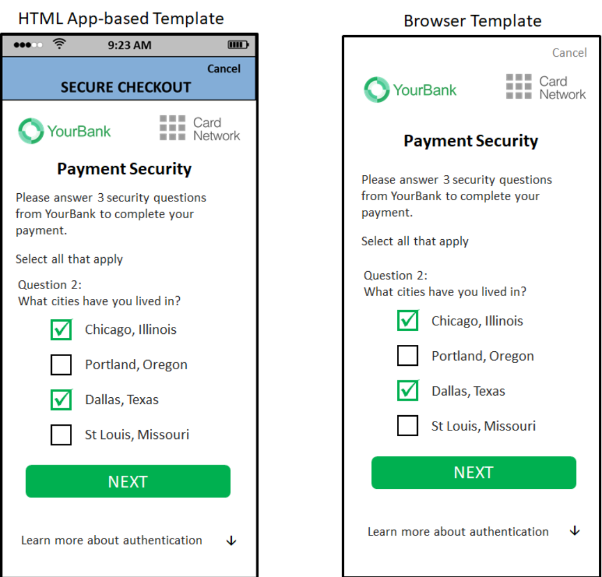

---

## PDF page 140

Figure 4.50 depicts a sample Browser Lightbox processing screen without a white box.

Figure 4.50:  Sample Browser Lightbox Processing Screen without White Box

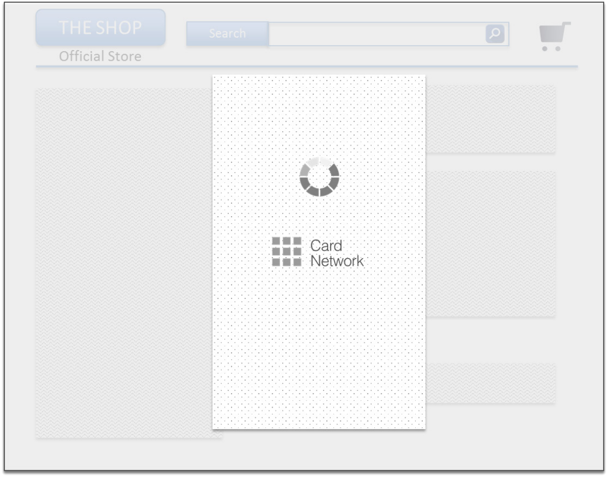

---

## PDF page 141

Figure 4.51 depicts a sample Inline Browser Processing screen with a white box.

Figure 4.51:  Sample Inline Browser Processing Screen with White Box

---

## PDF page 142

Figure 4.52 depicts a sample Browser with Lightbox UI.

Figure 4.52:  Sample Browser with Lightbox UI—PA

---

## PDF page 143

Figure 4.53 depicts a sample Browser with Inline UI.

Figure 4.53:  Sample Browser with Inline UI—PA

Note:  For Browser-based Decoupled Authentication transactions, the 3DS Requestor Website displays the Processing Screen followed by a display of the Cardholder Information Text within the 3DS Requestor’s checkout page (this is the same as App- based Decoupled transactions, as depicted in Figure 4.13.

---

## PDF page 144

### 4.4 3RI Considerations

The two types of 3RI transactions have different UI considerations. The first type mainly concerns recurring transactions where the 3DS Requestor wants to verify that a subscription user still has a valid form of payment. As the Cardholder is not present, there is no user interface presented for this type of 3RI transaction. The second type of 3RI transaction is when the 3DS Requestor requests Decoupled Authentication as a method to authenticate the Cardholder, for example, a MOTO transaction. The user interface provided by the ACS for Decoupled Authentication is outside the scope of the EMV 3-D Secure protocol. The 3DS Requestor can display a Processing Screen during AReq/ARes message processing and convey the Cardholder Information Text element if provided by the ACS in the ARes message. For a MOTO transaction, the 3DS Requestor’s customer service representative, can convey the Cardholder Information Text verbally for transactions conducted via a landline or feature phone.