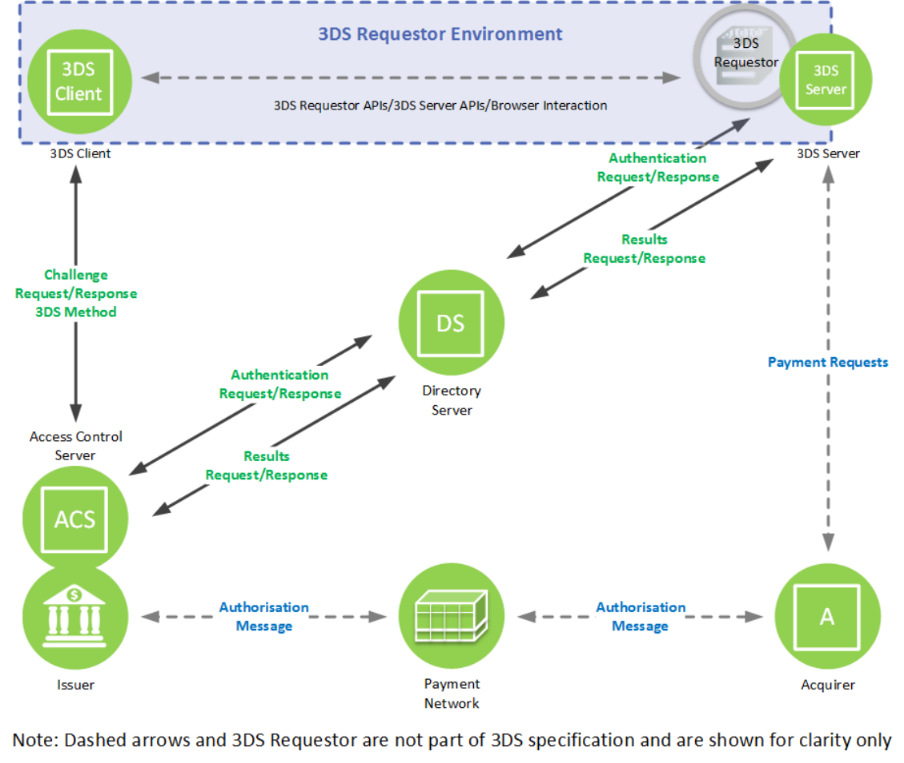

# PDF page 35

> English source extraction. Translation status is shown on the home page. Tables are reconstructed from the PDF; this is not an official EMVCo edition.

[Contents](../../index.md) · [Previous](./034.md) · [Next](./036.md)

## 2 EMV 3-D Secure Overview

This overview describes the components, the systems, and the functions necessary to implement 3-D Secure. Descriptions are divided into the following domains:

- Acquirer Domain—3-D Secure transactions are initiated from the Acquirer Domain

- Interoperability Domain—3-D Secure transactions are switched between the Acquirer Domain and Issuer Domain

- Issuer Domain—3-D Secure transactions are authenticated in the Issuer Domain

Figure 2.1 depicts the interaction of the three domains and the components of each. Because the implementation of the 3DS Requestor Environment may vary, the diagram purposefully does not imply a specific implementation of these components or how they interoperate. For example, the 3DS Client may communicate directly with the 3DS Server, or the 3DS Server and 3DS Requestor may be functionally combined.

Figure 2.1:  3-D Secure Domains and Components

---

[Contents](../../index.md) · [Previous](./034.md) · [Next](./036.md)
