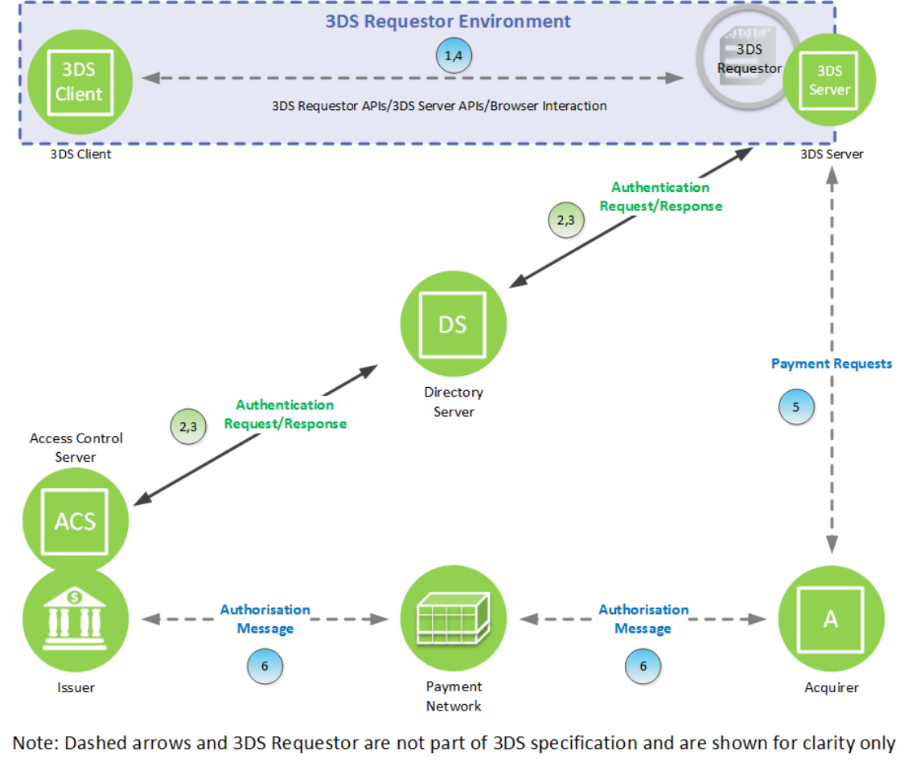

# PDF page 43

> English source extraction. Translation status is shown on the home page. Tables are reconstructed from the PDF; this is not an official EMVCo edition.

[Contents](../../index.md) · [Previous](./042.md) · [Next](./044.md)

### 2.6 Frictionless Flow Outline

Figure 2.2 depicts the steps of the Frictionless Flow.

Figure 2.2:  Frictionless Flow

The Frictionless Flow comprises the following Steps:

Start: Cardholder—Cardholder initiates a transaction on a Consumer Device. The Cardholder provides the information necessary for the authentication (Cardholder entry or already on file with the Merchant).

1. 3DS Requestor Environment—Within the 3DS Requestor Environment, the necessary 3-D Secure information is gathered and provided to the 3DS Server for inclusion in the AReq message.

How information is provided, and from which component, depends on the following:

- Device Channel—App-based (Section 2.6.1) or Browser-based (Section 2.6.2)

- Message Category—Payment or Non-Payment

- 3DS Requestor 3-D Secure implementation (Section 2.1.1)

---

[Contents](../../index.md) · [Previous](./042.md) · [Next](./044.md)
