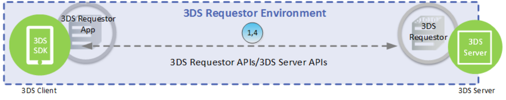

# PDF page 44

> English source extraction. Translation status is shown on the home page. Tables are reconstructed from the PDF; this is not an official EMVCo edition.

[Contents](../../index.md) · [Previous](./043.md) · [Next](./045.md)

2. 3DS Server through DS to ACS—Using the information provided by the Cardholder and data gathered within the 3DS Requestor Environment, the 3DS Server creates and sends an AReq message to the DS, which then forwards the message to the appropriate ACS.

3. ACS through DS to 3DS Server—In response to the AReq message, the ACS returns an ARes message to the DS, which then forwards the message to the initiating 3DS Server.

Before returning the response, the ACS evaluates the data provided in the AReq message. In a Frictionless Flow, the ACS determines that further Cardholder interaction is not required to complete the authentication.

4. 3DS Requestor Environment—The 3DS Server communicates the result of the ARes message to the 3DS Requestor Environment which then informs the Cardholder.

As defined in Section 2.1.1, the 3DS Requestor determines how the interaction between these components is implemented. Refer to Sections 2.6.1 and 2.6.2 for additional information.

Note: 3-D Secure processing ends here. For Payment Authorisation, the subsequent steps apply:

5. Merchant and Acquirer—The Merchant proceeds with authorisation exchange with its Acquirer. If appropriate, the Merchant, Acquirer, or Payment Processor can submit a standard authorisation request.

6. Payment Authorisation—The Acquirer can process an authorisation with the Issuer through the Payment System and return the authorisation results to the Merchant.

### 2.6.1 3DS Requestor Environment—App-based

In an App-based model, the communication flows between the 3DS SDK/3DS Requestor App and the 3DS Server/3DS Requestor using the APIs made available from the 3DS Server/3DS Requestor. Figure 2.3 depicts the 3DS Requestor Environment in an App-based model.

Figure 2.3:  3DS Requestor Environment—Frictionless Flow—App-based

Functionality for Step 1 and Step 4 is defined in Section 2.6, with the following clarifications:

Start: Cardholder and 3DS Requestor App—The Cardholder initiates a transaction using a 3DS Requestor App on a Consumer Device.

1. 3DS SDK and 3DS Server—The 3DS SDK/3DS Requestor App communicates with the 3DS Server/3DS Requestor. Sensitive information from the Consumer Device is encrypted before being sent in the AReq message to the DS.

---

[Contents](../../index.md) · [Previous](./043.md) · [Next](./045.md)
