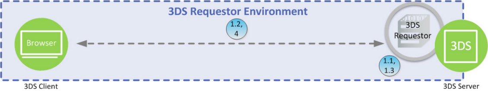

# PDF page 45

> English source extraction. Translation status is shown on the home page. Tables are reconstructed from the PDF; this is not an official EMVCo edition.

[Contents](../../index.md) · [Previous](./044.md) · [Next](./046.md)

4. 3DS Server and 3DS SDK—The 3DS Server/3DS Requestor communicates the result of the ARes message to the 3DS SDK/3DS Requestor App, which then informs the Cardholder.

### 2.6.2 3DS Requestor Environment—Browser-based

In a Browser-based model, the communication flows between the Consumer Device and the 3DS Server/3DS Requestor using a TLS Browser connection. Figure 2.4 depicts the 3DS Requestor Environment.

Figure 2.4:  3DS Requestor Environment—Browser-based

Functionality for Step 1 and Step 4 is defined in Section 2.6, with the following clarifications: Start: Cardholder—The Cardholder initiates the transaction using a Browser on a Consumer Device using a website operated by the 3DS Requestor.

1.1 3DS Requestor and 3DS Server—The 3DS Requestor communicates with the 3DS Server. The 3DS Server determines the ACS and DS Protocol Version(s) and, if present obtains the 3DS Method URL for the requested card range and returns the information to the 3DS Requestor. The ACS and DS Protocol Version(s) and 3DS Method URL data were previously received by the 3DS Server via a PRes message.

1.2 3DS Method on the 3DS Requestor checkout page—The 3DS Requestor checkout page loads the 3DS Method URL, if present, which allows the ACS to obtain additional Browser information for risk-based decisioning.

1.3 3DS Requestor and 3DS Server—The 3DS Requestor provides the necessary 3-D Secure information for the transaction to the 3DS Server.

4. 3DS Server and 3DS Requestor—The 3DS Server communicates the result of the ARes message to the 3DS Requestor and completes the transaction. The 3DS Integrator determines how the interaction between these components is implemented.

### 2.6.3 3DS Requestor Environment—3RI

For 3RI transactions, the 3DS Requestor Environment uses only the 3DS Requestor and the 3DS Server as the transaction is initiated by the 3DS Requestor and not the Cardholder. Figure 2.5 depicts the 3DS Requestor Environment for a 3RI transaction.

---

[Contents](../../index.md) · [Previous](./044.md) · [Next](./046.md)
