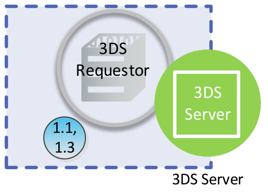

# PDF page 46

> English source extraction. Translation status is shown on the home page. Tables are reconstructed from the PDF; this is not an official EMVCo edition.

[Contents](../../index.md) · [Previous](./045.md) · [Next](./047.md)

Figure 2.5:  3DS Requestor Environment—3RI

The communication flows between the 3DS Requestor and 3DS Server are defined by the specific 3DS Integrator implementation. Start: 3DS Requestor—3DS Requestor needs to confirm an account.

1.1 3DS Requestor and 3DS Server—3DS Requestor initiates communications with the 3DS Server and provides the necessary 3-D Secure related information for the transaction to the 3DS Server.

1.3 3DS Server and 3DS Requestor—3DS Server communicates the result of the ARes message to the 3DS Requestor Server.

---

[Contents](../../index.md) · [Previous](./045.md) · [Next](./047.md)
