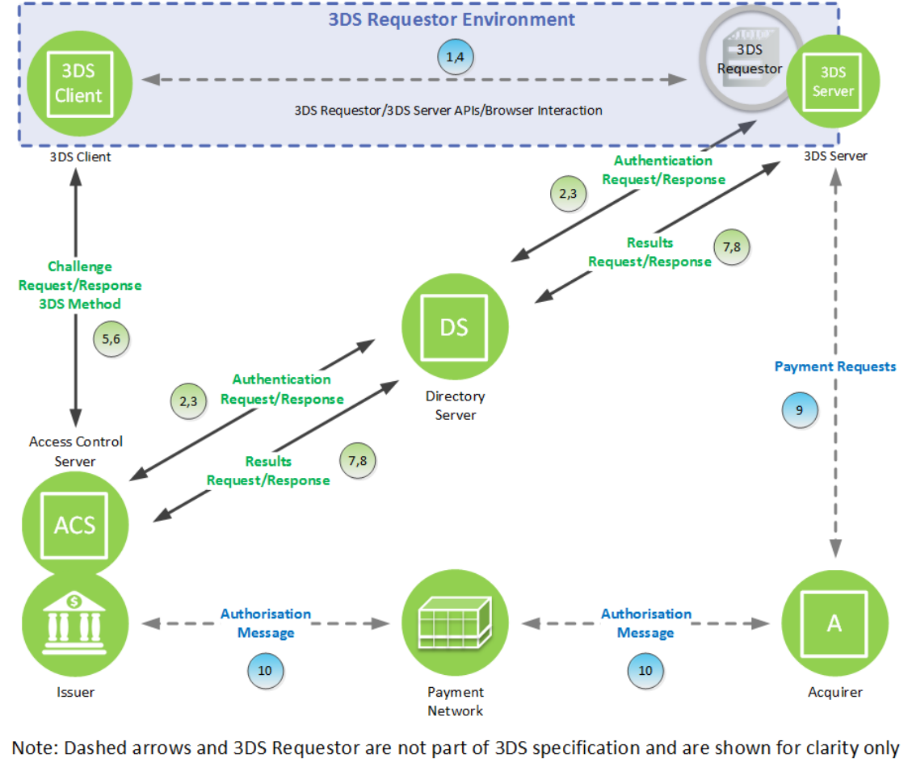

# PDF page 47

> English source extraction. Translation status is shown on the home page. Tables are reconstructed from the PDF; this is not an official EMVCo edition.

[Contents](../../index.md) · [Previous](./046.md) · [Next](./048.md)

### 2.7 Challenge Flow Outline

Figure 2.6 depicts the steps of the Challenge Flow.

Figure 2.6:  Challenge Flow

The Challenge Flow comprises the following Steps: Start: Cardholder—Same as the Frictionless Flow.

1. 3DS Requestor Environment—Same as the Frictionless Flow.

2. 3DS Server through DS to ACS—Same as the Frictionless Flow.

3. ACS through DS to 3DS Server—Same as the Frictionless Flow except that the ARes message indicates that further Cardholder interaction is required to complete the authentication.

4. 3DS Server to 3DS Requestor Environment—Same as the Frictionless Flow except that further Cardholder interaction is required to complete the authentication.

---

[Contents](../../index.md) · [Previous](./046.md) · [Next](./048.md)
