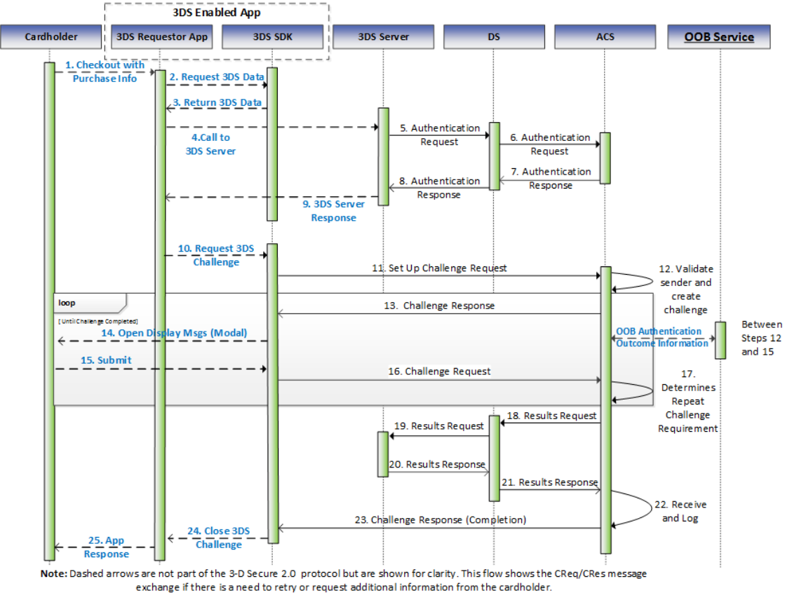

# PDF page 65

> English source extraction. Translation status is shown on the home page. Tables are reconstructed from the PDF; this is not an official EMVCo edition.

[Contents](../../index.md) · [Previous](./064.md) · [Next](./066.md)

### 3.2 Challenge Flow with OOB Authentication Requirements

Figure 3.2:  Out-of-Band Processing Flow

An Out-of-Band (OOB) Challenge Flow is identical to a standard 3-D Secure Processing Flow as defined in Section 3.1 with the following exceptions: Step 7: The ACS recognises that an OOB interaction with the Cardholder is required. Step 13: The challenge information in the CRes message consists of Cardholder instructions on how to perform the OOB authentication. Between Step 13 and Step 15:  The ACS initiates an OOB interaction with the Cardholder rather than interacting with the Cardholder via the 3DS SDK. During the OOB authentication the Cardholder authenticates to the ACS or a service provider/Issuer interacting with the ACS. See Section 3.2.1 for additional OOB requirements. The method used for the OOB communication and the authentication method itself is outside the scope of this specification. An example of an OOB communication could be a push notification to a banking app that completes authentication and then sends the results to the ACS. The ACS may use a combination of OOB automatic switching options (OOB App URL, 3DS Requestor App URL) to switch between the 3DS Requestor App and the OOB Authentication App following the requirements in Section 3.2.2. Step 17: The ACS receives only an acknowledgement that the Cardholder may have performed the OOB authentication, thus in [Req 61] the ACS gathers the information on whether the authentication was successful from the OOB interaction with the Cardholder instead of the CReq message. If the ACS determines that the Cardholder did not

---

[Contents](../../index.md) · [Previous](./064.md) · [Next](./066.md)
