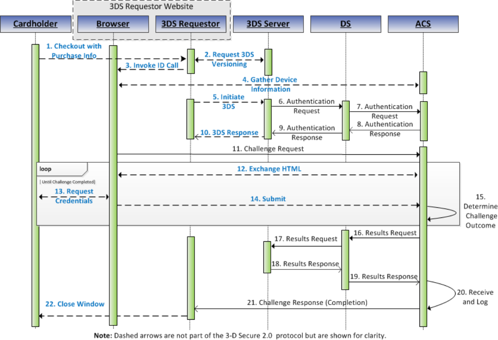

# PDF page 69

> English source extraction. Translation status is shown on the home page. Tables are reconstructed from the PDF; this is not an official EMVCo edition.

[Contents](../../index.md) · [Previous](./068.md) · [Next](./070.md)

### 3.3 Browser-based Requirements

The Steps in the authentication flow are outlined in Figure 3.3 with detailed requirements following the figure.

Figure 3.3:  3-D Secure Processing Flow Steps—Browser-based

Figure 3.3 portrays a possible flow for components within the 3DS Requestor Environment and does not preclude a specific implementation. Refer to Section 2.1.1 for additional information about the 3DS Requestor Environment. Note: Step 10 through Step 21 are applicable only for the Challenge Flow. Note: For a Decoupled Authentication challenge, instead of using the CReq and CRes messages (Steps 11 through 15 and Step 21), the ACS authenticates the Cardholder outside of the EMV 3-D Secure protocol. The Decoupled Authentication flow is portrayed in Figure 3.4 and outlined below. The 3-D Secure processing flow for Browser-based implementations contains the following Steps:

Step 1: The Cardholder

The Cardholder interacts with the 3DS Requestor using a Browser on a Consumer Device and confirms the applicable business logic. For example, the Cardholder makes an e- commerce purchase on a Merchant website using a Consumer Device.

Step 2: The 3DS Server/3DS Requestor

The 3DS Requestor initiates communications with the 3DS Server and provides the necessary 3-D Secure information to the 3DS Server to initiate Cardholder authentication.

---

[Contents](../../index.md) · [Previous](./068.md) · [Next](./070.md)
