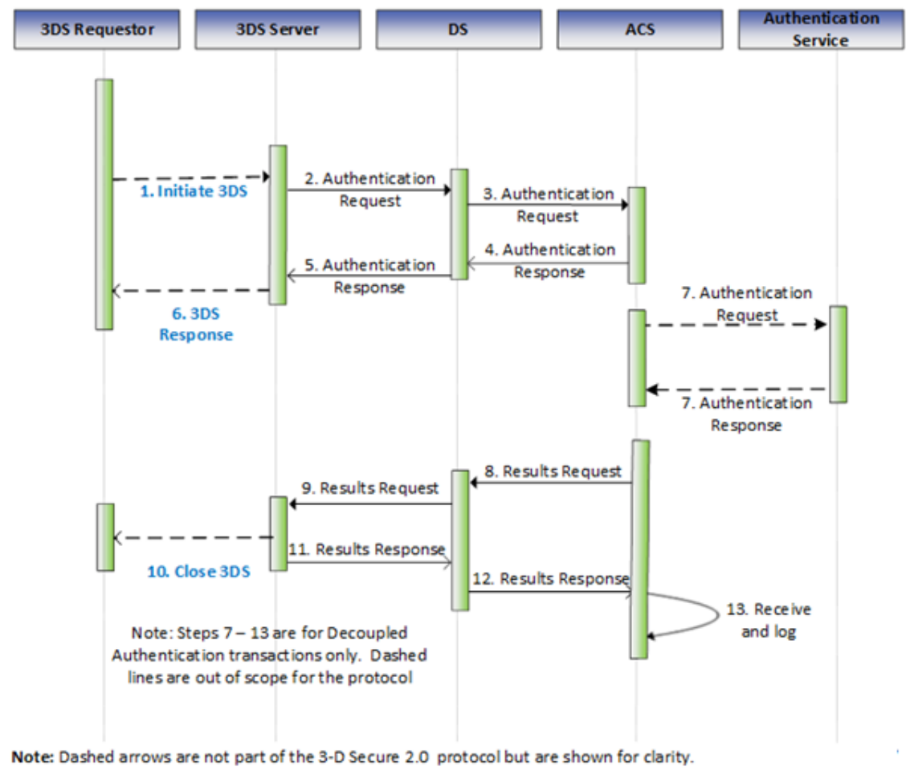

# PDF page 82

> English source extraction. Translation status is shown on the home page. Tables are reconstructed from the PDF; this is not an official EMVCo edition.

[Contents](../../index.md) · [Previous](./081.md) · [Next](./083.md)

### 3.4 3RI-based Requirements

The Steps in the 3RI flow are outlined in Figure 3.4 with detailed requirements following the figure. The 3RI flow supports two primary main use cases: confirmation of account information (accomplished through Steps 1–6) and Cardholder authentication (accomplished through Steps 1–13).

Figure 3.4:  3-D Secure Processing Flow Steps—3RI-based

The 3-D Secure processing flow for 3RI-based implementations contains the following Steps:

---

[Contents](../../index.md) · [Previous](./081.md) · [Next](./083.md)
