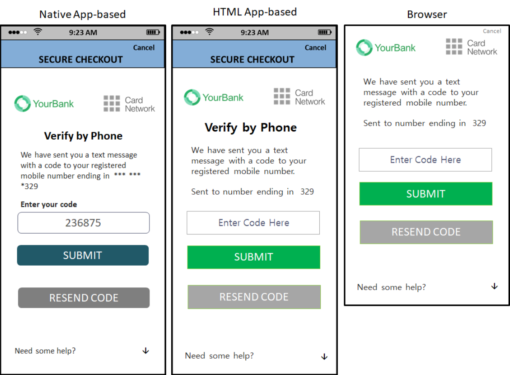
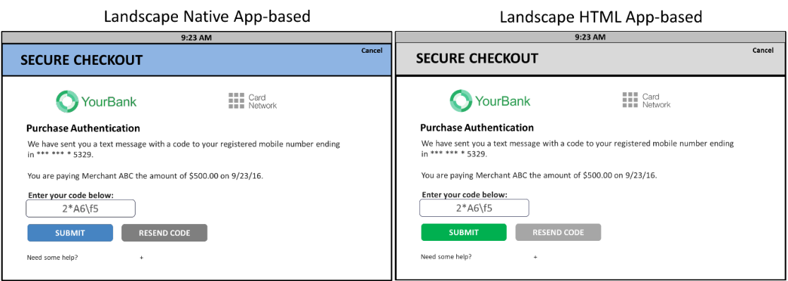

# PDF page 97

> English source extraction. Translation status is shown on the home page. Tables are reconstructed from the PDF; this is not an official EMVCo edition.

[Contents](../../index.md) · [Previous](./096.md) · [Next](./098.md)

Figure 4.3 through Figure 4.5: illustrate the consistency of the look and feel across device channels and implementations.

Figure 4.3:  UI Template Examples—All Device Channels

Figure 4.4 illustrates the consistency of the UI in landscape mode.

Figure 4.4:  UI Template Examples—App-based—Landscape

Note:  The device header is optional and may not be present depending on the 3DS Requestor implementation and OS constraints. Figure 4.5 depicts sample Native UI formats with or without a device header.

---

[Contents](../../index.md) · [Previous](./096.md) · [Next](./098.md)
