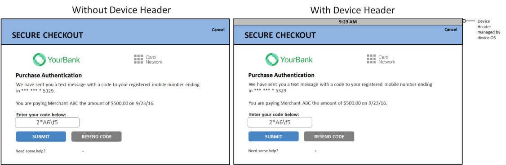

# PDF page 98

> English source extraction. Translation status is shown on the home page. Tables are reconstructed from the PDF; this is not an official EMVCo edition.

[Contents](../../index.md) · [Previous](./097.md) · [Next](./099.md)

Figure 4.5:  Sample UI OTP/Text Template with/without Device Header

### 4.2 App-based User Interface Overview

In an App-based implementation, the 3DS Requestor App and the 3DS SDK control the rendering of the UI. Each 3DS SDK is responsible for creating the UI elements that are specific to that particular environment, for example, the operating systems (OS) on a Consumer Device. The Consumer Device determines the UI format. Either:

- Native

- HTML

- Both Native and HTML

Note:  The UI format should remain consistent during the CReq/CRes message exchange. For example, if starting with a Native format, then every exchange should remain a Native format. The supported digital image file types are png and jpeg. Any other image types implemented by the ACS may not be supported by the 3DS SDK. Note: Some platforms may not natively support all image types.

---

[Contents](../../index.md) · [Previous](./097.md) · [Next](./099.md)
