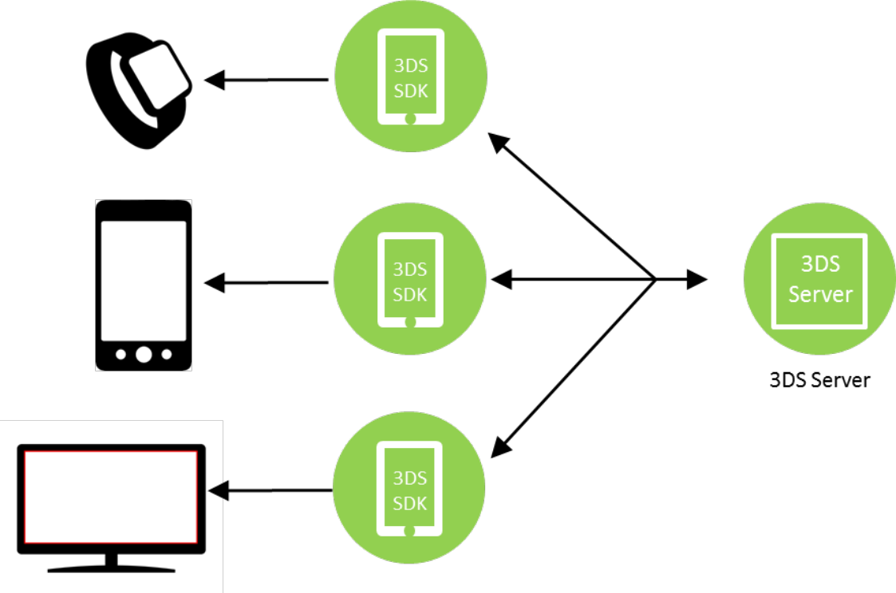

# PDF page 99

> English source extraction. Translation status is shown on the home page. Tables are reconstructed from the PDF; this is not an official EMVCo edition.

[Contents](../../index.md) · [Previous](./098.md) · [Next](./100.md)

Figure 4.6 depicts three App-based interface scenarios and illustrates a unique 3DS SDK for each.

Figure 4.6:  3DS SDK Options

### 4.2.1 Processing Screen Requirements

During message exchanges, a screen should be displayed to the Cardholder to indicate that 3-D Secure processing is occurring. The processing screen is applicable to both Native and HTML implementations.

---

[Contents](../../index.md) · [Previous](./098.md) · [Next](./100.md)
