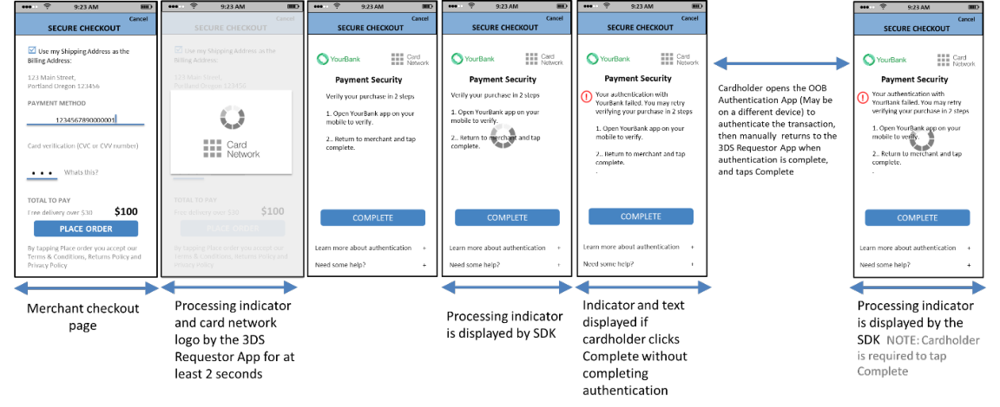
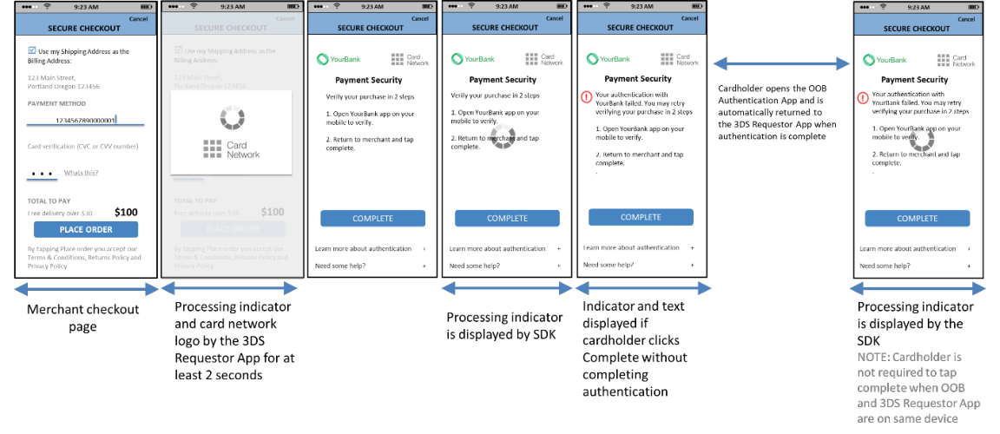

# PDF page 102

> English source extraction. Translation status is shown on the home page. Tables are reconstructed from the PDF; this is not an official EMVCo edition.

[Contents](../../index.md) · [Previous](./101.md) · [Next](./103.md)

Figure 4.10 provides a sample format for the OOB template for a manual transfer to and from the OOB Authentication App for an App-based processing flow.

Figure 4.10:  Sample OOB Template (Manual transfer to and from the OOB App)—App- based Processing Flow

Figure 4.11 provides a sample format for the OOB template for a manual transfer to the OOB App and an automatic return to the 3DS Requestor App for an App-based processing flow. The 3DS Requestor and OOB Apps are on the same device.

Figure 4.11:  Sample OOB Template (OOB App and 3DS Requestor App on same device)—w/o OOB App launch button—App-based Processing Flow

---

[Contents](../../index.md) · [Previous](./101.md) · [Next](./103.md)
