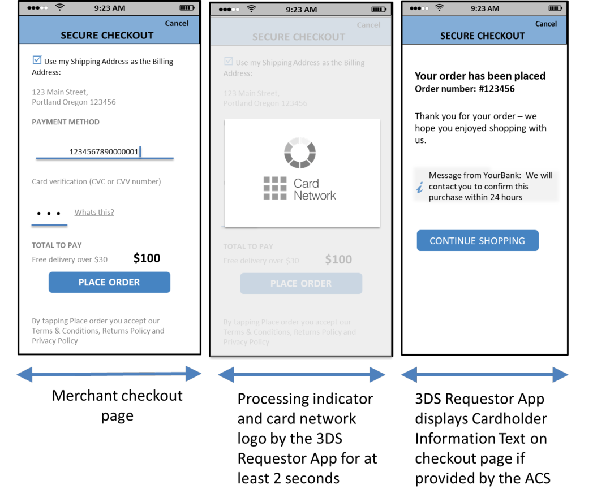

# PDF page 104

> English source extraction. Translation status is shown on the home page. Tables are reconstructed from the PDF; this is not an official EMVCo edition.

[Contents](../../index.md) · [Previous](./103.md) · [Next](./105.md)

Figure 4.13:  Sample Decoupled Authentication Template—App-based Processing Flow

Notes:

- There is no difference in Native vs. HTML experience.

- The 3DS SDK could dim the challenge window during spinning wheel display or the wheel could be translucent.

- The spinning wheel would be displayed through the timeout/retry process.

- If the Cardholder has been authenticated, then the Cardholder is returned to the Merchant. If the Cardholder has not authenticated, then the UI is updated to reinforce the expected Cardholder action.

- For Decoupled Authentication, the UI provided by the ACS for Cardholder authentication is out of scope of the EMV 3-D Secure specifications.

### 4.2.2 Native UI Display Requirements

The Native UI integrates into the 3DS Requestor App UI to facilitate a consistent user experience. The Native UI has a similar look and feel to the 3DS Requestor’s App, with the authentication content provided by the Issuer. This format also allows for Issuer and Payment System branding. Both the 3DS Requestor App and the 3DS SDK control the rendering of the UI such that the authentication pages inherit the 3DS Requestor’s UI design elements (for example, fonts). Details of the UI

---

[Contents](../../index.md) · [Previous](./103.md) · [Next](./105.md)
