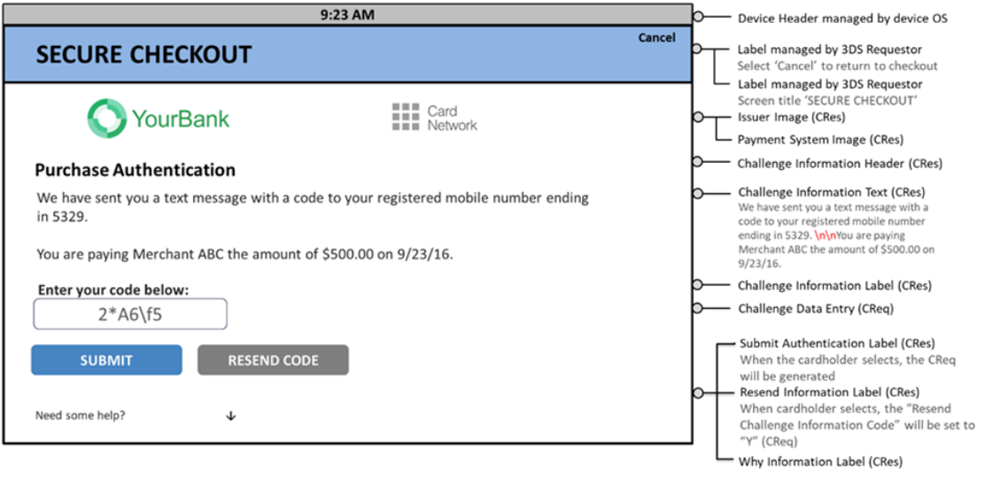

# PDF page 108

> English source extraction. Translation status is shown on the home page. Tables are reconstructed from the PDF; this is not an official EMVCo edition.

[Contents](../../index.md) · [Previous](./107.md) · [Next](./109.md)

Figure 4.15:  Sample Native UI OTP/Text Template—PA—Landscape

Figure 4.16 and Figure 4.17 provide sample formats with the optional second one-time passcode (OTP)/Text during a Payment Authentication transaction. This sample UI provides a format using expandable fields for additional information.

---

[Contents](../../index.md) · [Previous](./107.md) · [Next](./109.md)
