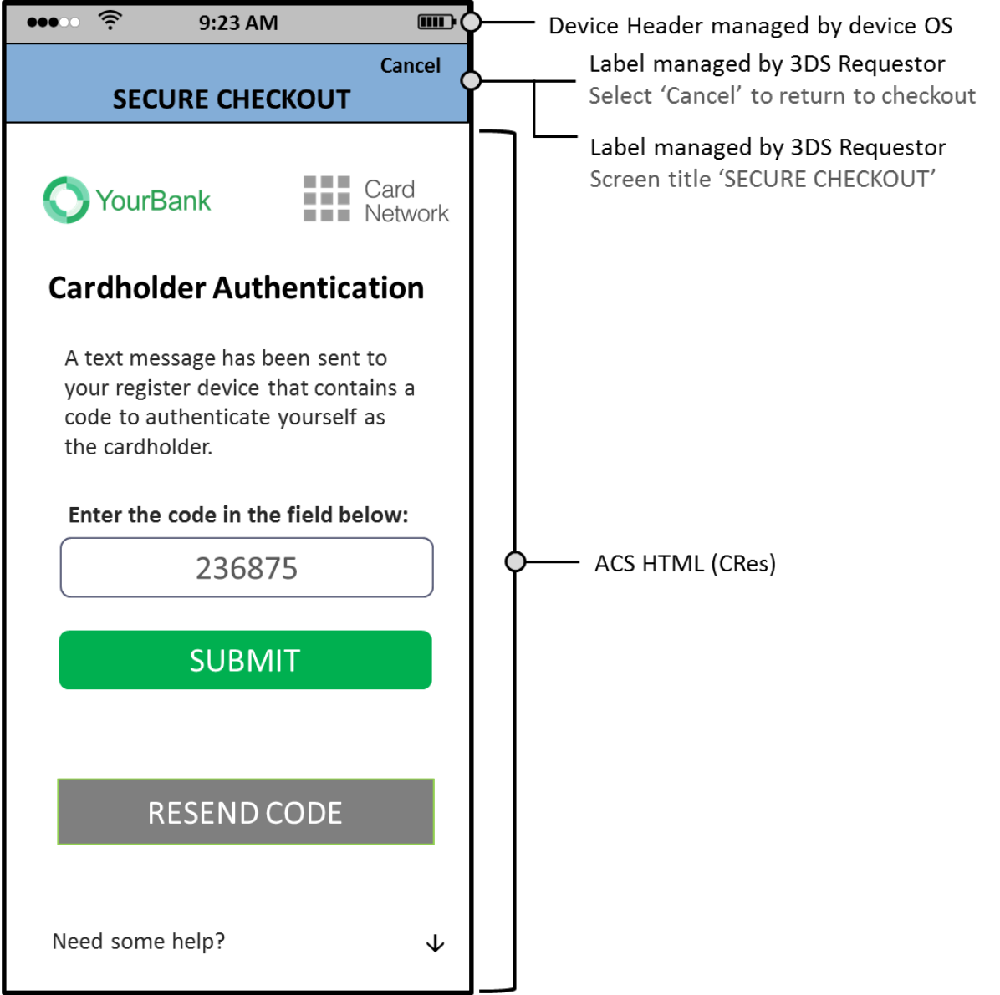

# PDF page 127

> English source extraction. Translation status is shown on the home page. Tables are reconstructed from the PDF; this is not an official EMVCo edition.

[Contents](../../index.md) · [Previous](./126.md) · [Next](./128.md)

Figure 4.40 provides a sample Non-Payment Authentication HTML OTP UI template that includes Issuer branding. The HTML templates for Single-select and Multi-select are visually similar to the Native UI and therefore not repeated.

Figure 4.40:  Sample UI OTP/Text Template—NPA

---

[Contents](../../index.md) · [Previous](./126.md) · [Next](./128.md)
