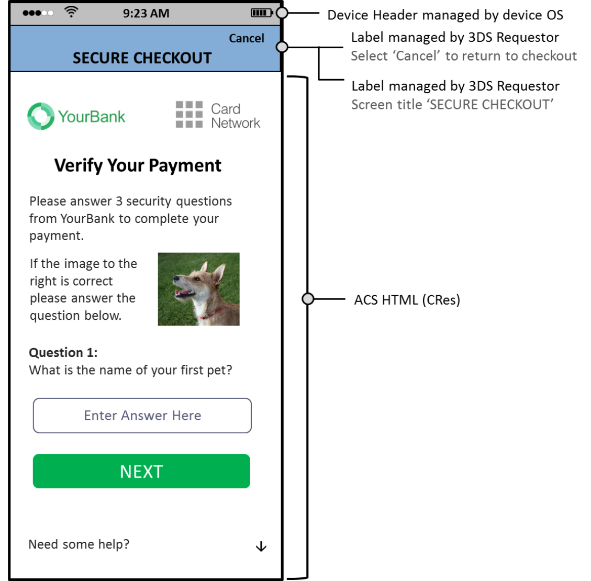

# PDF page 134

> English source extraction. Translation status is shown on the home page. Tables are reconstructed from the PDF; this is not an official EMVCo edition.

[Contents](../../index.md) · [Previous](./133.md) · [Next](./135.md)

Figure 4.47 and Figure 4.48 provide sample HTML Other templates asking the Cardholder to answer questions and confirm an image. There is not an existing data element in the Native format that supports the presentation of an image during authentication, however, the HTML Other will allow for this authentication experience.

Figure 4.47:  Sample HTML Other UI Template—PA—Portrait

---

[Contents](../../index.md) · [Previous](./133.md) · [Next](./135.md)
