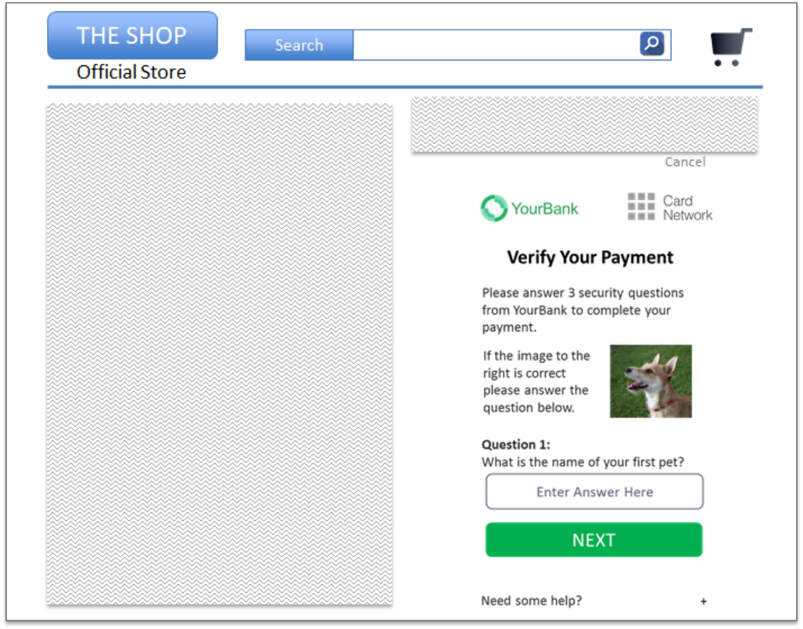

# PDF page 143

> English source extraction. Translation status is shown on the home page. Tables are reconstructed from the PDF; this is not an official EMVCo edition.

[Contents](../../index.md) · [Previous](./142.md) · [Next](./144.md)

Figure 4.53 depicts a sample Browser with Inline UI.

Figure 4.53:  Sample Browser with Inline UI—PA

Note:  For Browser-based Decoupled Authentication transactions, the 3DS Requestor Website displays the Processing Screen followed by a display of the Cardholder Information Text within the 3DS Requestor’s checkout page (this is the same as App- based Decoupled transactions, as depicted in Figure 4.13.

---

[Contents](../../index.md) · [Previous](./142.md) · [Next](./144.md)
