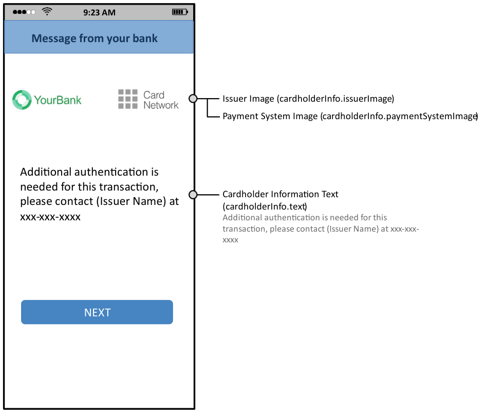

# PDF page 369

> English source extraction. Translation status is shown on the home page. Tables are reconstructed from the PDF; this is not an official EMVCo edition.

[Contents](../../index.md) · [Previous](./368.md) · [Next](./370.md)

### A.20 Cardholder Information Text

Figure A.1 and Figure A.2 provide a sample UI format to display the Cardholder Information Text to the Cardholder.

Figure A.1  Sample Cardholder Information UI Example—App—Portrait

---

[Contents](../../index.md) · [Previous](./368.md) · [Next](./370.md)
