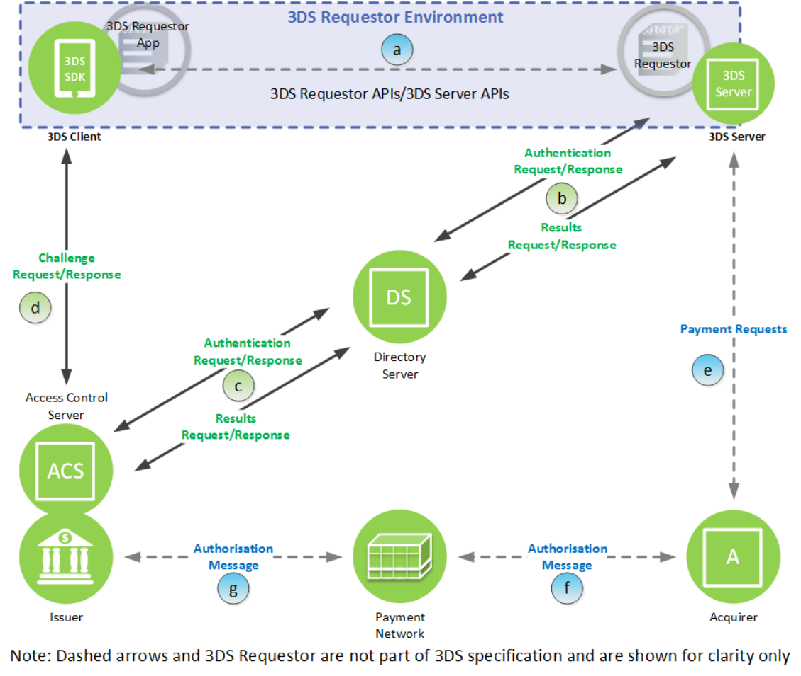
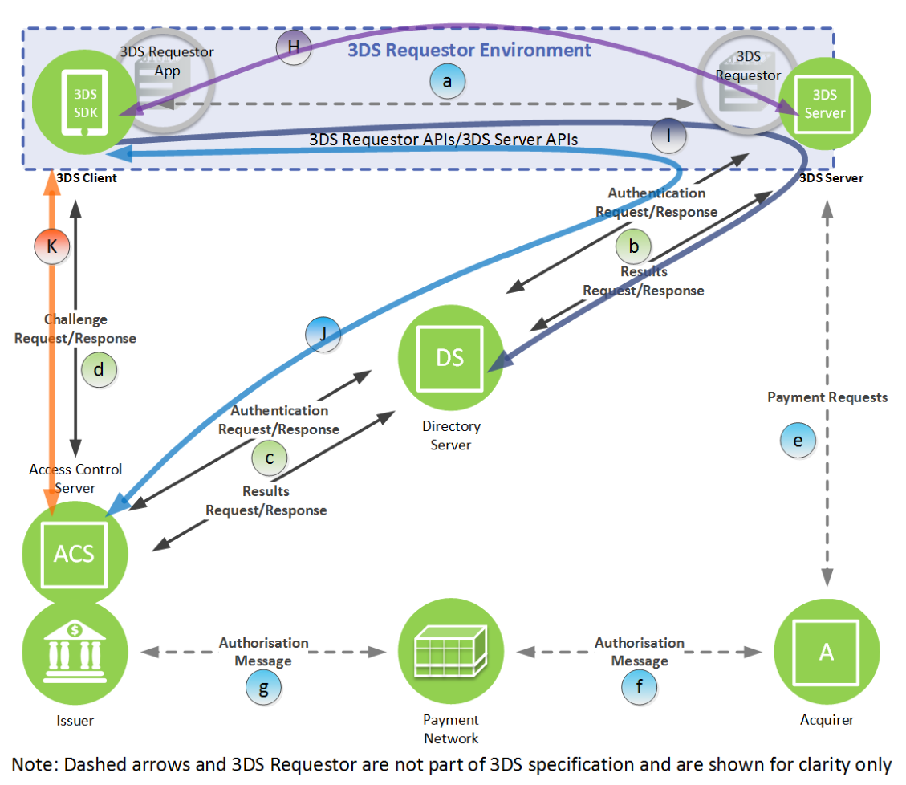

# セキュリティ要件

> 非公式の日本語参考訳。図内の文字は英語原文のままです。

[目次](../../index.md) · [英語原文](../../en/chapters/06.md)

## 原本 172ページ

## 6 EMV 3-D Secureのセキュリティ要件

本章では、本仕様内で参照するEMV 3-D Secureセキュリティ要件の詳細を示す。具体的には、3-D Secure構成要素間の接続に期待する特性と、3-D Secureのセキュリティ機能を説明する。図6.1と図6.2の文字は、以下の各節で定義する接続を指す。

---

## 原本 173ページ

### 6.1 接続

各接続には、以下の期待事項が適用される。

### 6.1.1 接続a：消費者端末―3DS Requestor

消費者端末と3DS Requestorの接続は、3DS Requestor Environment内の、3DS Requestor Appと3DS Requestorの間にある。消費者端末上のアプリまたはブラウザと3DS Requestorの対話の一部として、TLSインターネットプロトコルを使用する。

3DS Method NotificationまたはCResの返却URLが開始元のエンドポイントと異なる場合、ブラウザと3DS Requestor Environmentの間に追加の接続が必要になることがある。

カード会員と3DS Requestorの対話が3-D Secureプロトコル固有の動作に移行したとき、接続は保護された状態である必要がある。これは3DS Requestor固有のものだが、決済システムのセキュリティ要件を満たし、少なくとも3DS Requestor Appまたはブラウザによる3DS Requestor（サーバ）の認証を行うTLSプロトコルを使用することが期待される。

---

## 原本 174ページ

3DS Requestorと3DS Serverが別の構成要素である場合、両サーバの相互認証を行い、転送データを決済システムのセキュリティ要件を満たす水準で保護する必要がある。

実装によっては、顧客がアプリやブラウザから3DS Requestorにログオンして対話を開始し、最初から接続が3DS Requestorのセキュリティ要件を満たす場合がある。この処理による顧客認証の水準は、3DS Requestor Authentication Informationデータ要素で伝える。

これらのすべての接続にTLS 1.2以上を使用することを推奨する。

### 6.1.2 接続b：3DS Server―DS

### 6.1.2.1 AReq／AResの場合

3DS ServerからDSへのAReq／AResの接続は、相互認証付きTLSで確立する。双方の公開鍵証明書はDS CAが署名する。複数のDSに接続する場合、3DS Serverは必要な選択を行う。

- プロトコル：附属書Dの暗号スイートを使用するTLS。
- 3DS Server公開鍵：PbR。クライアント証明書形式：X.509。
- DS公開鍵：PbDS。サーバ証明書形式：X.509。
- 3DS Server鍵の署名CA：DS CA。
- DS鍵の署名CA：DS CA。

### 6.1.2.2 RReq／RResの場合

DSから3DS ServerへのRReq／RResの接続は、相互認証付きTLSで確立する。双方の公開鍵証明書はDS CAが署名する。

- プロトコル：附属書Dの暗号スイートを使用するTLS。
- DS公開鍵：PbDS。クライアント証明書形式：X.509。
- 3DS Server公開鍵：PbR。サーバ証明書形式：X.509。
- DS鍵の署名CA：DS CA。
- 3DS Server鍵の署名CA：DS CA。

### 6.1.3 接続c：DS―ACS

### 6.1.3.1 AReq／AResの場合

DSからACSへのAReq／AResの接続は、相互認証付きTLSで確立する。双方の公開鍵証明書はDS CAが署名する。

- プロトコル：附属書Dの暗号スイートを使用するTLS。
- DS公開鍵：PbDS。クライアント証明書形式：X.509。

---

## 原本 175ページ

- ACS公開鍵：PbACS。サーバ証明書形式：X.509。
- DS鍵の署名CA：DS CA。
- ACS鍵の署名CA：DS CA。

### 6.1.3.2 RReq／RResの場合

ACSからDSへのRReq／RResの接続は、相互認証付きTLSで確立する。双方の公開鍵証明書はDS CAが署名する。

- プロトコル：附属書Dの暗号スイートを使用するTLS。
- ACS公開鍵：PbACS。クライアント証明書形式：X.509。
- DS公開鍵：PbDS。サーバ証明書形式：X.509。
- ACS鍵の署名CA：DS CA。
- DS鍵の署名CA：DS CA。

### 6.1.4 接続d：3DS Client―ACS

### 6.1.4.1 アプリ方式のCReq／CResの場合

アプリ方式では、チャレンジが必要な取引でのみ3DS SDKとACSの直接接続を確立する。3DS SDKがAResで提供されたURLを使って開始し、SDKによるACS（サーバ）認証付きTLSで確立する。ACSの公開鍵証明書は商用CAが署名する。

- プロトコル：TLS 1.2以上。
- ACS公開鍵：商用。証明書形式：商用。
- ACS鍵の署名CA：商用CA。

チャレンジとカード会員の応答データは、ACSと3DS SDKの間で事前に確立したセッション鍵を使って暗号化し、MACを付与する。

- プロトコル：事前に確立したセッション鍵を使用する、6.2.4節のセキュアな通信経路。

CResに、外部サーバからデータを取得するよう3DS SDKに指示するURLがある場合、商用サーバ証明書に基づくSDKのサーバ認証付きTLSで、追加の接続を確立する。

### 6.1.4.2 ブラウザ方式のCReq／CResの場合

ブラウザ方式では、チャレンジが必要な取引でのみブラウザとACSの直接接続を確立する。ブラウザがAResで提供されたURLを使ってiframeから開始し、ブラウザによるACS（サーバ）認証付きTLSで確立する。ACSの公開鍵証明書は商用CAが署名する。

- プロトコル：TLS 1.2以上。
- ACS公開鍵：商用。

---

## 原本 176ページ

- 証明書形式：商用。
- ACS鍵の署名CA：商用CA。

### 6.1.5 接続e：3DS Integrator―アクワイアラ（支払認証のみ）

これは加盟店の通常の支払接続である。3-D Secureは追加のセキュリティ要件を定めない。

### 6.1.6 接続f：アクワイアラ―決済システム（支払認証のみ）

これは該当する決済システムの通常のネットワークを通じた接続である。3-D Secureは追加のセキュリティ要件を定めない。

### 6.1.7 接続g：決済システム―イシュア（支払認証のみ）

これは該当する決済システムの通常のネットワークを通じた接続である。3-D Secureは追加のセキュリティ要件を定めない。

### 6.1.8 接続h：ブラウザ―ACS（3DS Method用）

3DS Methodの接続は、3DS Serverがチェックアウトページの一部として読み込む非表示iframeから開く。ACSが端末情報を収集し、自身に返すために使用する。情報には、正しい取引と関連付けるための3DS Server Transaction IDを含める。

3DS Method用のACS URLはチャレンジフロー用URLとは別とみなし、それぞれに別のTLS接続を確立する。ブラウザによるACSのサーバ認証付きTLSで接続を確立する。ACSの公開鍵証明書は商用CAが署名する。

- プロトコル：TLS 1.2以上。
- ACS公開鍵：商用。証明書形式：商用。
- ACS鍵の署名CA：商用CA。

注：3RI取引では、AReq／AResの接続b・cを持つ3DS Server、DS、ACSだけが適用される。

---

## 原本 177ページ

### 6.2 セキュリティ機能

インターネットを使う接続に加え、アプリ方式のフローに固有のセキュリティ機能がある。

### 6.2.1 機能H：3DS SDKの真正性

EMVCo承認済み3DS SDKをアプリに組み込んで導入する3DS Requestorは、SDKが変更されていないことの確認を含め、3DS Requestorに対して3DS Requestor Appを認証する仕組みを持つ必要がある。Split-SDKでは、Split-SDK ServerとSplit-SDK Client構成要素の固有の関係によって対応できる。

### 6.2.2 機能I：3DS SDK端末情報の暗号化と、DS向けのSplit-SDK Server署名

3DS SDKからDSへのこれらの機能は、3DS Serverを経由して行う。目的は次ページに示す。

---

## 原本 178ページ

- 3DS SDKがACS向けのデータ（例えばDevice Information）を暗号化できるようにする。ACSが信頼するDSで復号するため、SDKのデータがACSに安全に届けられる。
- Split-SDKが、DSで確認するためのSplit-SDK Server署名を提供できるようにする。

### 6.2.2.1 3DS SDK端末情報の暗号化

前提として、3DS SDKはDSの公開鍵PDSを読み込んでいるか、アクセスできる必要がある。各DSには複数の鍵があってもよく、それぞれ個別の識別子PDSidを持つ。PDSidにはUUID形式を推奨する。

3DS SDKは次を行う。

- 3DS Requestor Environmentが提供する情報から、DS公開鍵PDS、関連属性、暗号化機能（BINおよび任意のその他の情報に関連）を識別する。公開鍵を識別できなければ処理を停止し、エラーを報告する。
- Device InformationのJSONオブジェクトを作成する。

PDSがRSA鍵の場合、JWE Compact Serializationを使い、JWE（RFC 7516）に従ってJSONオブジェクトを暗号化する。本版でJWE protected headerに含めるパラメータは次のとおりである。

| パラメータ | 値 |
| --- | --- |
| alg | RSA-OAEP-256 |
| kid | PDSid |
| enc | A128CBC-HS256 または A128GCM |
| その他 | すべて任意 |

PDSがECC鍵の場合、次のように暗号化する。

- 附属書Cに従い、新しい一時鍵ペア（QSDK, dSDK）を生成する。
- JWA（RFC 7518）のDirect Key Agreementモードで、ECDH-ES、曲線P-256、dSDKとPDS、Concat KDFを使用したDH鍵交換を行い、256-bit CEKを生成する。本版のConcat KDFのパラメータは次のとおりである。

| パラメータ | 値 |
| --- | --- |
| Keydatalen | 256 |
| AlgorithmID | 空文字列（length = 0x00000000） |
| PartyUInfo | 空文字列（length = 0x00000000） |
| PartyVInfo | directoryServerID（length &#124;&#124; ascii string） |
| SuppPubInfo | Keydatalen（0x00000100） |
| SuppPrivInfo | 空のオクテット列 |

- IVとして128-bitのランダムデータを生成し、JWEに含める。
- CEKとJWE Compact Serializationを使い、JWE（RFC 7516）に従ってJSONオブジェクトを暗号化する。本版でJWE protected headerに含めるパラメータは、`alg`が`ECDH-ES`であり、残りは次ページに続く。

---

## 原本 179ページ

ECC鍵の場合のJWE protected headerの続き：

| パラメータ | 値 |
| --- | --- |
| kid | PDSid |
| epk | QSDK。kty = EC、crv = P-256、x = QSDKのx座標、y = QSDKのy座標を持つJWK |
| enc | A128CBC-HS256 または A128GCM |
| その他 | すべて任意 |

A128CBC-HS256ではCEK全体を使用し、A128GCMではCEKの左端128 bitを使用する。一時鍵ペア（QSDK, dSDK）を削除する。

生成したJWEをSDK Encrypted Dataとして3DS Serverが利用できるようにする。

### 6.2.2.2 DSによる端末情報の復号

DSは次を行う。

SDK Encrypted DataのJWE protected headerがRSA-OAEP-256による暗号化を示す場合：

- ヘッダーの値（RSA-OAEP-256および`kid`が示すPDS）を使い、JWE（RFC 7516）に従ってAReqのSDK Encrypted Dataを復号する。ヘッダーの`enc`が示すA128CBC-HS256またはA128GCMを使用する。

ECDH-ESによる暗号化を示す場合：

- ヘッダーの値（ECDH-ES、曲線P-256、QSDK、および`kid`が示すdDS）とConcat KDFを使い、JWA（RFC 7518）のDirect Key AgreementモードでDH鍵交換を行い、256-bit CEKを生成する。本版のパラメータは次のとおりである。

| パラメータ | 値 |
| --- | --- |
| Keydatalen | 256 |
| AlgorithmID | 空文字列（length = 0x00000000） |
| PartyUInfo | 空文字列（length = 0x00000000） |
| PartyVInfo | directoryServerID（length &#124;&#124; ascii string） |
| SuppPubInfo | Keydatalen（0x00000100） |
| SuppPrivInfo | 空のオクテット列 |

- CEKと、ヘッダーの`enc`が示すA128CBC-HS256またはA128GCMを使い、JWE（RFC 7516）に従ってSDK Encrypted Dataを復号する。A128GCMの場合、CEKの左端128 bitを使用する。復号に失敗した場合、処理を停止しエラーを報告する。

ACSへのAReqのDevice Informationに、復号結果を設定する。

### 6.2.2.3 Split-SDK Serverの署名

Split-SDK Serverは、特定の取引データにタイムスタンプ付きの署名を作成し、検証のためDSに送信する。

---

## 原本 180ページ

前提として、Split-SDK Serverは鍵ペア（PbSDK, PvSDK）と証明書Cert(PbSDK)を持つ。この証明書は、DSが公開鍵を知っているDS CAが署名したX.509証明書である。

Split-SDK Serverは次を行う。

- 署名対象のJWSペイロードとして、SDK Reference Number、SDK Transaction ID、Split-SDK Server ID、SDK Signature TimestampのJSONオブジェクトを作成する。
- JWS Compact Serializationを使い、JWS（RFC 7515）に従ってJSONオブジェクト全体に電子署名を生成する。本版でJWSヘッダーに含めるパラメータは次のとおりである。

| パラメータ | 値 |
| --- | --- |
| alg | PS256〔注7〕またはES256 |
| x5c | X.5C v3：Cert(PbSDK)と、存在する場合は証明書チェーン。DS CAの公開鍵証明書は含めない |
| その他 | すべて任意 |

- 生成したJWSをSDK Server Signed ContentとしてAReqに含める。

### 6.2.2.4 DSによるSplit-SDK Server Signed Contentの検証

DSは、DS CAのCA公開鍵を使い、ヘッダーの`alg`が示すPS256またはES256で、JWS（RFC 7515）に従ってSplit-SDK ServerのJWSを検証する。失敗した場合、処理を停止しエラーを報告する。

署名が有効なら、DSはSplit-SDK Serverの真正性と、SDK Reference Numberおよび日付が正しいことを確認できたことになる。

### 6.2.3 機能J：3DS SDK―ACS間のセキュアな通信経路の設定

3DS SDKとACSは、AReq／AResで転送するデータを使ってDH鍵交換を実行し、セキュアな通信経路の鍵を確立する。取引でチャレンジが必要な場合、後にチャレンジフローのCReq／CResを保護するために使用する。

### 6.2.3.1 3DS SDKによる通信経路の準備

3DS SDKは、附属書Cに従って新しい一時鍵ペア（QC, dC）を生成し、QCをJWKとして提供する。AReqのsdkEphemPubKeyに含める。

### 6.2.3.2 ACSによる通信経路の設定

ACSがチャレンジを必要と判断した場合、CReq／CRes用の3DS SDKとの直接接続を保護するため、AReq／ARes交換中に次のセキュリティ機能を完了する。

前提として、ACSは鍵ペア（PbACS, PvACS）とCert(PbACS)を持つ。この証明書は、3DS SDKが公開鍵を知っているDS CAが署名したX.509証明書である。

注7：RFC 3447（2003）の推奨に従い、RS256（RSASSA-PKCS1-v1_5）よりPS256（RSA-PSS）を優先して指定する。

---

## 原本 181ページ

ACSは、3DS ServerとDSを経由するAReqで、3DS SDKのQCを受信する。自身の一時公開鍵QT、受信したQC、SDKがCReqで使用するACS URLをまとめて署名する。その署名を、ACS公開鍵のCert(PbACS)とともに3DS SDKに返す。

ACSは次を行う。

- 附属書Cに従い、新しい一時鍵ペア（QT, dT）を生成する。
- QCが曲線P-256上の点であることを確認する。
- JWA（RFC 7518）のDirect Key Agreementモードで、ECDH-ES、曲線P-256、dT、QC、Concat KDFを使い、ローカル機構としてDH鍵交換を完了する。256-bit CEKを生成し、ACS Transaction IDに関連付ける。本版のパラメータは次のとおりである。

| パラメータ | 値 |
| --- | --- |
| Keydatalen | 256 |
| AlgorithmID | 空文字列（length = 0x00000000） |
| PartyUInfo | 空文字列（length = 0x00000000） |
| PartyVInfo | sdkReferenceNumber（length &#124;&#124; ascii string） |
| SuppPubInfo | Keydatalen（0x00000100） |
| SuppPrivInfo | 空のオクテット列 |
| CEK | 256 bit。CEKA-S：256 bit、CEKS-A：256 bitとして割当て |

注：3DS SDK―ACS間で方向ごとに鍵を分離することは適切な実践である。本版ではCEKA-SとCEKS-Aは同じ値として取り出す。そのためA128CBC-HS256では両方向で同じ256-bit鍵を使用する。A128GCMでは鍵を2つの128-bit部分に分割し、方向ごとに別の鍵を使用する。

- 署名対象のJWSペイロードとして、次のJSONオブジェクトを作成する：`{"acsEphemPubKey": QT, "sdkEphemPubKey": QC, "acsURL":"https://mybank.com/acs"}`。
- JWS Compact Serializationを使い、JWS（RFC 7515）に従ってJSONオブジェクト全体に電子署名を生成する。本版でJWSヘッダーに含めるパラメータは次のとおりである。

| パラメータ | 値 |
| --- | --- |
| alg | PS256〔注8〕またはES256 |
| x5c | X.5C v3：Cert(PbACS)と、存在する場合は証明書チェーン。DS CAの公開鍵証明書は含めない |
| その他 | すべて任意 |

- 生成したJWSをACS Signed ContentとしてAResに含める。

注8：RFC 3447（2003）の推奨に従い、RS256（RSASSA-PKCS1-v1_5）よりPS256（RSA-PSS）を優先して指定する。

---

## 原本 182ページ

- 一時鍵ペア（QT, dT）を削除する。
- 通信経路のカウンタACSCounterAtoS（8 bit）とACSCounterStoA（8 bit）をゼロにする。

### 6.2.3.3 3DS SDKによる通信経路の設定

3DS SDKは、3DS ServerがAResから取り出した必要なデータ要素（QT、ACS Signature、ACS Public Key Certificate、ACS URLを含む）を受信する。

3DS SDKは次を行う。

- 3DS Serverの情報から識別したDS CAのCA公開鍵を使い、ヘッダーの`alg`が示すPS256またはES256で、JWS（RFC 7515）に従ってACSのJWSを検証する。失敗した場合、処理を停止しエラーを報告する。
- 署名内のSDK Qcが、6.2.3.1節で生成してAReqのsdkEphemPubKeyとして提供したものと同じであることを検証する。
- JWA（RFC 7518）のDirect Key Agreementモードで、曲線P-256、dC、QT、Concat KDFを使ってDH鍵交換を完了し、256-bit CEKを生成する。AResで受信したACS Transaction IDに関連付ける。本版のパラメータは次のとおりである。

| パラメータ | 値 |
| --- | --- |
| Keydatalen | 256 |
| AlgorithmID | 空文字列（length = 0x00000000） |
| PartyUInfo | 空文字列（length = 0x00000000） |
| PartyVInfo | sdkReferenceNumber（length &#124;&#124; ascii string） |
| SuppPubInfo | Keydatalen（0x00000100） |
| SuppPrivInfo | 空のオクテット列 |
| CEK | 256 bit。CEKA-S：256 bit、CEKS-A：256 bitとして割当て |

- 一時鍵ペア（QC, dC）を削除する。
- 通信経路のカウンタSDKCounterAtoS（8 bit）とSDKCounterStoA（8 bit）をゼロにする。

ACS署名が有効なら、3DS SDKはACSの真正性、セッション鍵が新しいこと、ACS URLが正しいことを確認できたことになる。

### 6.2.4 機能K：3DS SDK―ACS（CReq、CRes）

### 6.2.4.1 3DS SDK：CReq

SDKからACSにCReqを送信する場合、3DS SDKは次を行う。

- 表B.3のCReqで指定するデータ要素のJSONオブジェクトを作成する。
- 6.2.3.3節で取得したCEKS-AとJWE Compact Serializationを使い、JWE（RFC 7516）に従って暗号化する。本版でJWE protected headerに含める`alg`は`dir`であり、`enc`などの値は次ページに続く。

---

## 原本 183ページ

JWE protected headerの続き：

- `enc`：SDK Type = 01ではA128CBC-HS256またはA128GCM。SDK Type = 02ではA128GCM。
- `kid`：ACS Transaction ID。
- その他のパラメータ：すべて任意。

A128CBC-HS256ではCEKS-A全体と、IVとして新しい128-bitランダムデータを使用する。A128GCMではCEKS-Aの左端128 bitと、左側を`00`バイトで埋めたSDKCounterStoAをIVとして使用する。

SDKCounterStoAを増分する。

- SDKCounterStoA ≠ zeroの場合、生成したJWEを保護されたCReqとしてACSに送る。
- SDKCounterStoA = zeroの場合、処理を停止しエラーを報告する。

### 6.2.4.2 3DS SDK：CRes

ACSからCResを受信する場合、3DS SDKは次を行う。

- protected headerの`enc`と`kid`が示す、A128CBC-HS256またはA128GCM、および6.2.3.3節のCEKA-Sを使い、JWE（RFC 7516）に従って復号する。失敗した場合、処理を停止しエラーを報告する。
- 復号したメッセージのACSCounterAtoSが、SDKCounterAtoSと数値的に等しいことを確認する。等しくなければ処理を停止しエラーを報告する。
- SDKCounterAtoSを増分する。SDKCounterAtoS = zeroとなった場合、処理を停止しエラーを報告する。

### 6.2.4.3 ACS：CReq

SDKからCReqを受信する場合、ACSは次を行う。

- protected headerの`enc`と`kid`が示す、A128CBC-HS256またはA128GCM、および6.2.3.2節のCEKS-Aを使い、JWE（RFC 7516）に従って復号する。失敗した場合、処理を停止しエラーを報告する。
- 復号したメッセージのSDKCounterStoAが、ACSCounterStoAと数値的に等しいことを確認する。等しくなければ処理を停止しエラーを報告する。
- ACSCounterStoAを増分する。ACSCounterStoA = zeroとなった場合、処理を停止しエラーを報告する。

### 6.2.4.4 ACS：CRes

ACSからSDKにCResを送信する場合、ACSは次を行う。

- 表B.4のCResで指定するデータ要素のJSONオブジェクトを作成する。
- SDKがCReqに使用したのと同じ`enc`アルゴリズム、`kid`が識別する6.2.3.2節のCEKA-S、JWE Compact Serializationを使い、JWE（RFC 7516）に従って暗号化する。本版でJWE protected headerに含める値は、`alg`が`dir`、`enc`がA128CBC-HS256またはA128GCMであり、残りは次ページに続く。

---

## 原本 184ページ

- `kid`：ACS Transaction ID。
- その他のパラメータ：すべて任意。

A128CBC-HS256ではCEKA-S全体と、IVとして新しい128-bitランダムデータを使用する。A128GCMではCEKA-Sの右端128 bitと、左側を`FF`バイトで埋めたACSCounterAtoSをIVとして使用する。

ACSCounterAtoSを増分する。

- ACSCounterAtoS ≠ zeroの場合、生成したJWEを保護されたCReqメッセージ（原文表記）として3DS SDKに送る。
- ACSCounterAtoS = zeroの場合、処理を停止しエラーを報告する。

> 訳注：本節はACSから送るCResを説明していますが、原文の最後の箇条書きには「protected CReq message」と記載されています。原文のメッセージ名を保持しました。