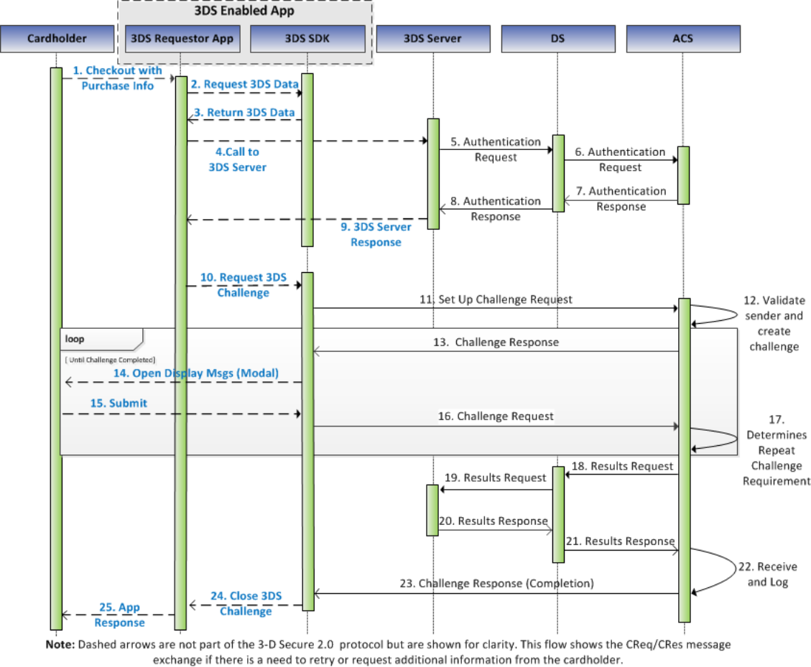

# PDF 50ページ — 日本語参考訳

> 非公式の日本語参考訳。原本のページ単位で対応しています。全文翻訳は未完了です。図内の文字は英語原文のままです。

[目次](../../index.md) · [英語原文](../../en/pages/050.md) · [前ページ](./049.md) · [次ページ](./051.md)

### 3.1 アプリ方式の要件

図3.1に認証フローの手順を示す。その後に詳細な要件を記載する。

図3.1は、3DS Requestor Environment内の構成要素について、実現可能なフローの一例を示したものであり、特定の実装を排除するものではない。同環境の詳細は2.1.1節を参照すること。

注：手順10〜25は、チャレンジフローにのみ適用される。

注：Decoupled Authenticationのチャレンジでは、CReqおよびCRes（手順10〜17と手順23）を使用する代わりに、ACSがEMV 3-D Secureプロトコルの外でカード会員を認証する。Decoupled Authenticationのフローは図3.4に示し、以下でも概説する。

アプリ方式の実装における3-D Secure処理フローは、次の手順を含む。

---

[目次](../../index.md) · [英語原文](../../en/pages/050.md) · [前ページ](./049.md) · [次ページ](./051.md)
