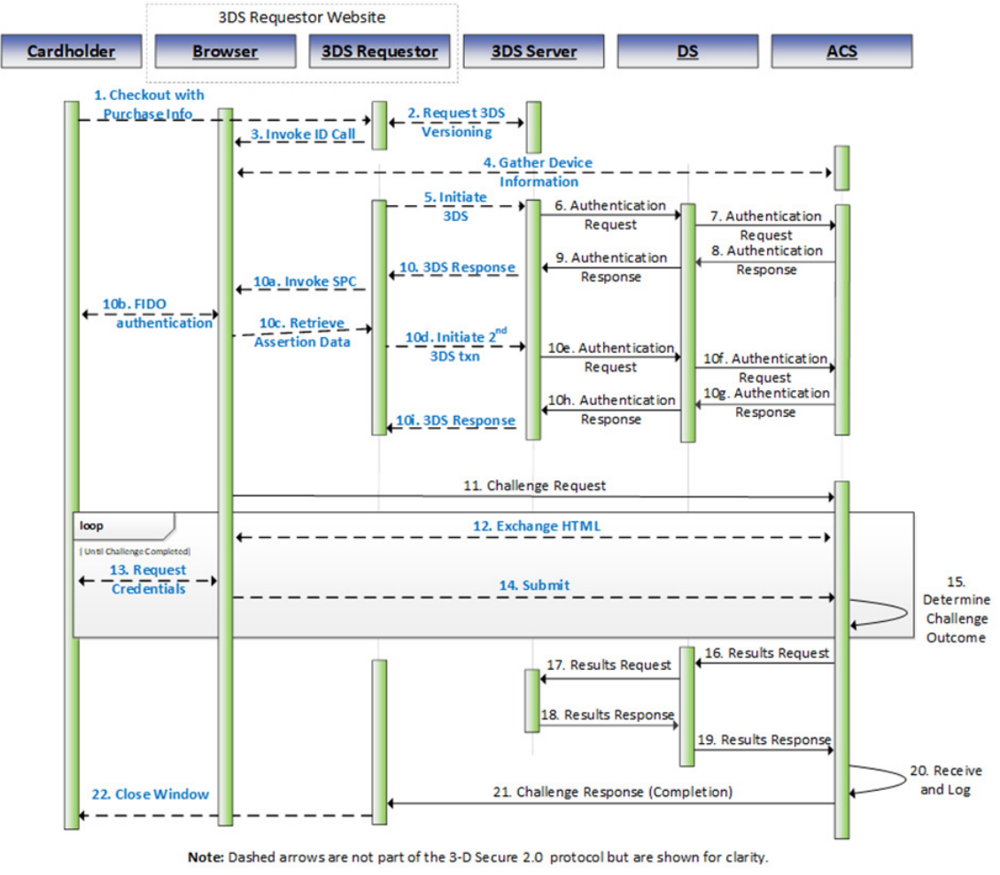

# PDF 90ページ — 日本語参考訳

> 非公式の日本語参考訳。原本のページ単位で対応しています。全文翻訳は未完了です。図内の文字は英語原文のままです。

[目次](../../index.md) · [英語原文](../../en/pages/090.md) · [前ページ](./089.md) · [次ページ](./091.md)

3DS Requestorが開始するSPC方式の認証フローは、次の例外と追加事項を除き、3.3節で定義する標準の3-D Secure処理フローと同じである。

**手順5：** 3DS Requestorが3DS認証を開始する。この取引でSPC認証に対応できることと、ブラウザがSPC APIに対応しているかを3DS Serverに示す。

**Seq 3.246 [Req 447]** 3DS RequestorのWebサイトは、手順10aでSPC APIを呼び出すまで、4.3.1.1節の要件に従って処理中画面を表示しなければならない。

**手順6：** 3DS ServerがACS Information Indicatorから、ACSがSPC方式の認証に対応していることを認識する。

**Seq 3.247 [Req 448]** 3DS Serverは、AReqに3DS Requestor SPC Support = Yを設定しなければならない。

**手順8：** ACSが、SPC方式の認証がサポートされていることを認識する。

**Seq 3.248 [Req 449]** ACSが認証方法としてSPCを選択した場合、次を返さなければならない。

- Transaction Status = S。
- このカード会員に関連付けられた登録済みFIDOクレデンシャル一覧（WebAuthn Credential list）。
- SPC Transaction Data（表A.28を参照）。

---

[目次](../../index.md) · [英語原文](../../en/pages/090.md) · [前ページ](./089.md) · [次ページ](./091.md)
