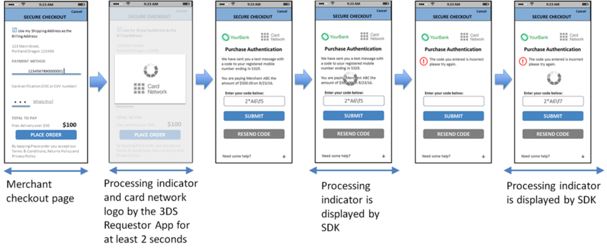

# PDF 101ページ — 日本語参考訳

> 非公式の日本語参考訳。原本のページ単位で対応しています。全文翻訳は未完了です。図内の文字は英語原文のままです。

[目次](../../index.md) · [英語原文](../../en/pages/101.md) · [前ページ](./100.md) · [次ページ](./102.md)

**Seq 4.11 [Req 144]** DSロゴを保存する。

3DS Requestor Appは、AReq／AResのやり取りについて次を実施しなければならない。

**Seq 4.12 [Req 145]** AReq／AResのメッセージサイクル全体を通じて、3DS SDKが提供する処理中画面を表示し、図4.7および図4.8のとおり加盟店のチェックアウトページに重ねて表示する。

**Seq 4.13 [Req 146]** 処理中画面を最低2秒間表示する。

3DS Requestor Appは、チャレンジの場合に次を実施しなければならない。

**Seq 4.14 [Req 388]** 3DS SDKが表示するHeaderゾーンのテキストとCancelアクションの名前を設定する。

3DS SDKは、CReq／CResのやり取りについて次を実施しなければならない。

**Seq 4.15 [Req 147]** 消費者端末のOSの既定のProcessing Graphic（例えばプログレスバーや回転する表示）のみで処理中画面を作成し、単語、テキスト、白いボックスを含めない（図4.9〜4.12参照）。

**Seq 4.16 [Req 148]** 処理中画面にDSロゴやその他のデザイン要素を含めない。

**Seq 4.17 [Req 151]** 2回目以降のCReq／CResメッセージサイクル中、処理中画面を最低1秒間表示する。初回のサイクルについては[Req 153]を参照すること。

**Seq 4.18 [Req 389]** 処理中画面の表示中は、Cancelアクションを実行できないようにする。

図4.9に、アプリ方式の処理フローの形式例を示す。

---

[目次](../../index.md) · [英語原文](../../en/pages/101.md) · [前ページ](./100.md) · [次ページ](./102.md)
