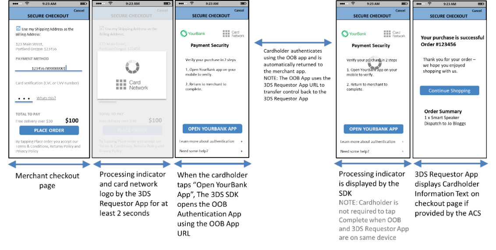

# PDF 103ページ — 日本語参考訳

> 非公式の日本語参考訳。原本のページ単位で対応しています。全文翻訳は未完了です。図内の文字は英語原文のままです。

[目次](../../index.md) · [英語原文](../../en/pages/103.md) · [前ページ](./102.md) · [次ページ](./104.md)

図4.12に、OOBアプリへの移動と復帰を自動で行う、アプリ方式のOOBテンプレートの形式例を示す。3DS Requestor AppとOOBアプリは同じ端末上にある。

図4.13に、Decoupled Authenticationフローの形式例を示す。

---

[目次](../../index.md) · [英語原文](../../en/pages/103.md) · [前ページ](./102.md) · [次ページ](./104.md)
