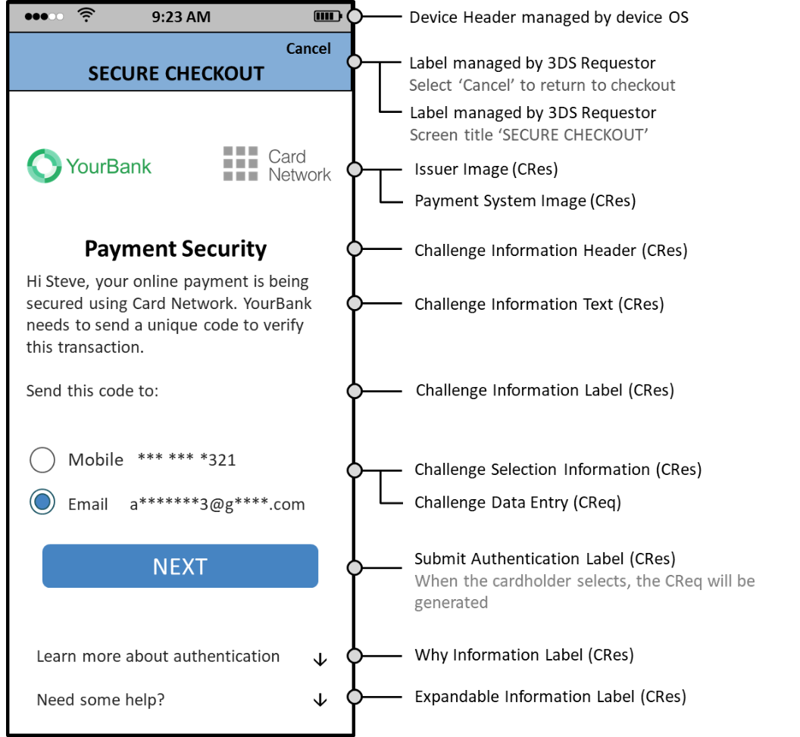
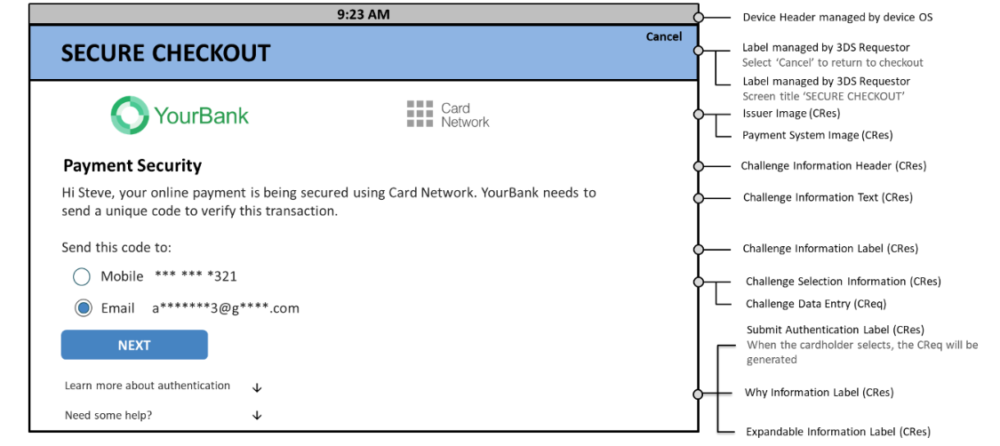

# PDF 111ページ — 日本語参考訳

> 非公式の日本語参考訳。原本のページ単位で対応しています。全文翻訳は未完了です。図内の文字は英語原文のままです。

[目次](../../index.md) · [英語原文](../../en/pages/111.md) · [前ページ](./110.md) · [次ページ](./112.md)

---

[目次](../../index.md) · [英語原文](../../en/pages/111.md) · [前ページ](./110.md) · [次ページ](./112.md)
