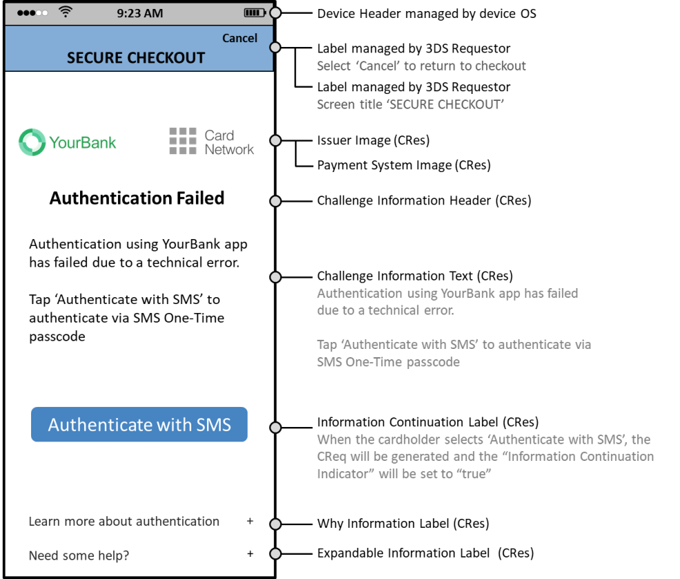
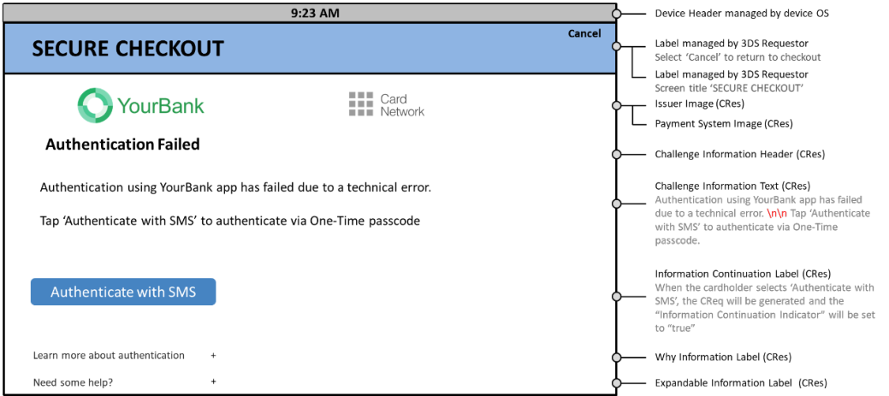

# PDF 120ページ — 日本語参考訳

> 非公式の日本語参考訳。原本のページ単位で対応しています。全文翻訳は未完了です。図内の文字は英語原文のままです。

[目次](../../index.md) · [英語原文](../../en/pages/120.md) · [前ページ](./119.md) · [次ページ](./121.md)

図4.34および図4.35に、購入認証中にChallenge Data Entry MaskingとChallenge Data Entry Masking Toggleの選択肢を使用する形式例を示す。

注：カード会員がOTPを入力し、Challenge Data Entry Masking Toggleを選択した後のUIを描いている。

---

[目次](../../index.md) · [英語原文](../../en/pages/120.md) · [前ページ](./119.md) · [次ページ](./121.md)
