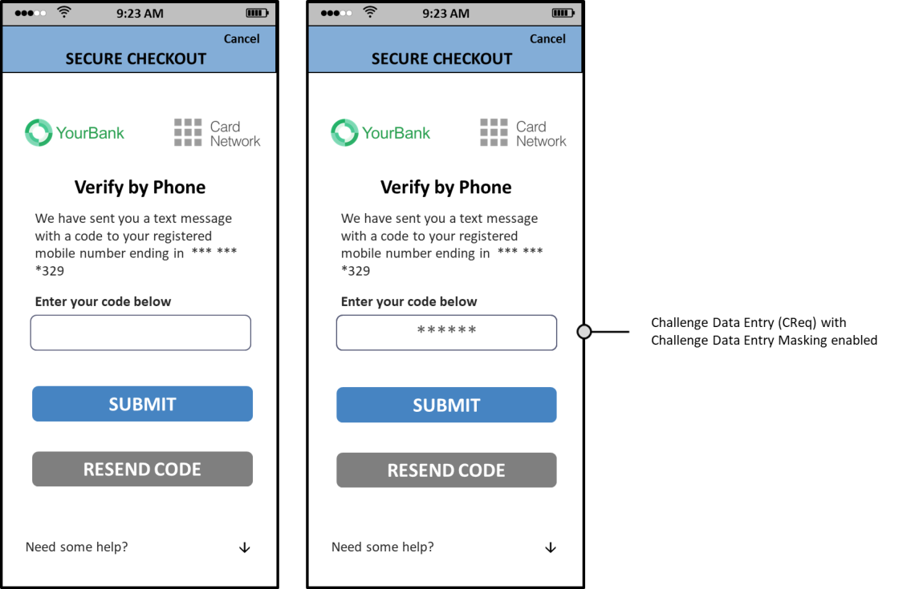
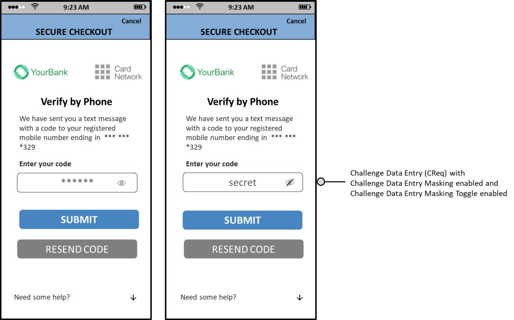

# PDF 121ページ — 日本語参考訳

> 非公式の日本語参考訳。原本のページ単位で対応しています。全文翻訳は未完了です。図内の文字は英語原文のままです。

[目次](../../index.md) · [英語原文](../../en/pages/121.md) · [前ページ](./120.md) · [次ページ](./122.md)

---

[目次](../../index.md) · [英語原文](../../en/pages/121.md) · [前ページ](./120.md) · [次ページ](./122.md)
