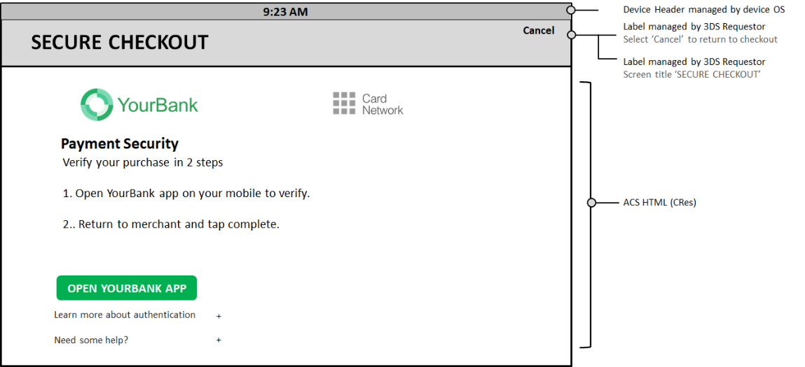

# PDF 131ページ — 日本語参考訳

> 非公式の日本語参考訳。原本のページ単位で対応しています。全文翻訳は未完了です。図内の文字は英語原文のままです。

[目次](../../index.md) · [英語原文](../../en/pages/131.md) · [前ページ](./130.md) · [次ページ](./132.md)

図4.45および図4.46に、イシュアのブランド表示を含み、カード会員向けの指示を表示するHTML Information UIテンプレートの例を示す。Information UIにより、イシュアはチャレンジ中に特定の情報を表示できる。例えば、エラーからの復旧や、カード会員による同意の確認に利用する。

---

[目次](../../index.md) · [英語原文](../../en/pages/131.md) · [前ページ](./130.md) · [次ページ](./132.md)
