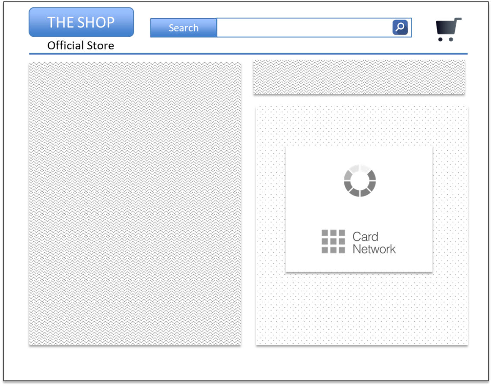

# PDF 141ページ — 日本語参考訳

> 非公式の日本語参考訳。原本のページ単位で対応しています。全文翻訳は未完了です。図内の文字は英語原文のままです。

[目次](../../index.md) · [英語原文](../../en/pages/141.md) · [前ページ](./140.md) · [次ページ](./142.md)

図4.51に、白いボックスのあるブラウザのInline処理中画面の例を示す。

---

[目次](../../index.md) · [英語原文](../../en/pages/141.md) · [前ページ](./140.md) · [次ページ](./142.md)
