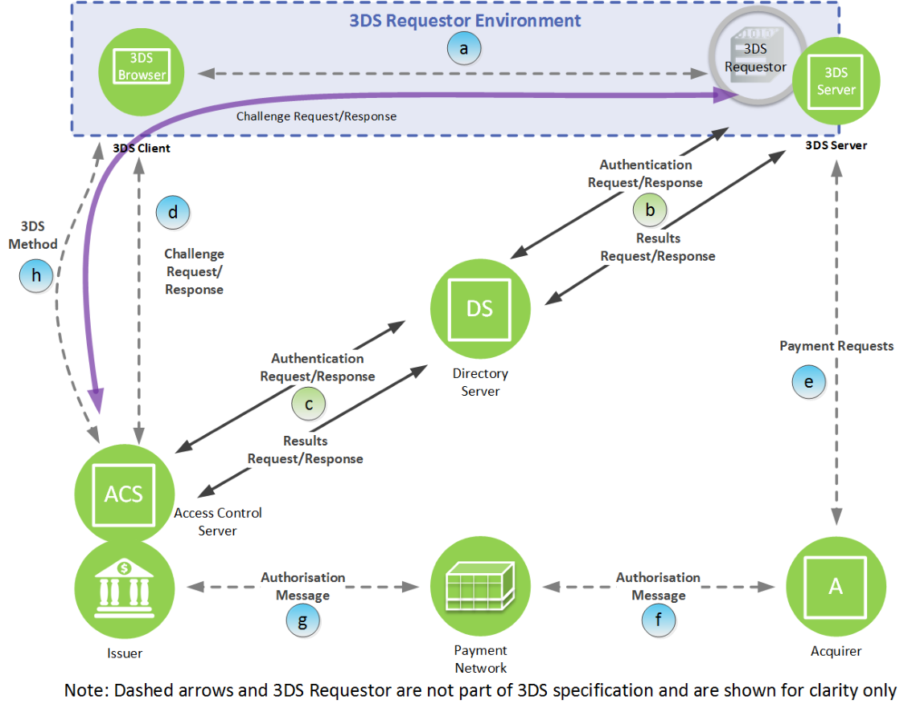

# PDF 173ページ — 日本語参考訳

> 非公式の日本語参考訳。原本のページ単位で対応しています。全文翻訳は未完了です。図内の文字は英語原文のままです。

[目次](../../index.md) · [英語原文](../../en/pages/173.md) · [前ページ](./172.md) · [次ページ](./174.md)

### 6.1 接続

各接続には、以下の期待事項が適用される。

### 6.1.1 接続a：消費者端末―3DS Requestor

消費者端末と3DS Requestorの接続は、3DS Requestor Environment内の、3DS Requestor Appと3DS Requestorの間にある。消費者端末上のアプリまたはブラウザと3DS Requestorの対話の一部として、TLSインターネットプロトコルを使用する。

3DS Method NotificationまたはCResの返却URLが開始元のエンドポイントと異なる場合、ブラウザと3DS Requestor Environmentの間に追加の接続が必要になることがある。

カード会員と3DS Requestorの対話が3-D Secureプロトコル固有の動作に移行したとき、接続は保護された状態である必要がある。これは3DS Requestor固有のものだが、決済システムのセキュリティ要件を満たし、少なくとも3DS Requestor Appまたはブラウザによる3DS Requestor（サーバ）の認証を行うTLSプロトコルを使用することが期待される。

---

[目次](../../index.md) · [英語原文](../../en/pages/173.md) · [前ページ](./172.md) · [次ページ](./174.md)
